Madis Cyber est une application web OpenSource conçue par [Soluris](https://www.soluris.fr/) pour permettre aux petites structures d'évaluer et de développeur leur protection face aux menaces Cyber. 

Elle permet notamment de les accompagner dans l'évaluation des risques liés à la cyber-criminalité, d’identifier et de planifier des mesures de sécurité.

# Se connecter à Madis Cyber

Madis Cyber est accessible depuis les navigateurs récents connectés à internet et sur la plupart des systèmes d'exploitation. L'interface est responsive et peut être consultée depuis tout client mobile tactile (préférer une tablette pour un confort d'affichage).

Pour se connecter, il est nécessaire de disposer d'un compte (l'identifiant est l'adresse email).


Le mot de passe peut être régénérer un en passant par « **J'ai oublié mon mot de passe** ».

Par défaut, les règles de sécurité du mot de passe sont les suivantes :
* 9 caractères ;
* au moins un chiffre et une lettre.

La case à cocher « **Se souvenir de moi** » permet de mémoriser la session dans le navigateur.

# Tableau de bord

Le tableau de bord permet d'avoir des indications sur l’état d’avancement de sa mise en conformité.

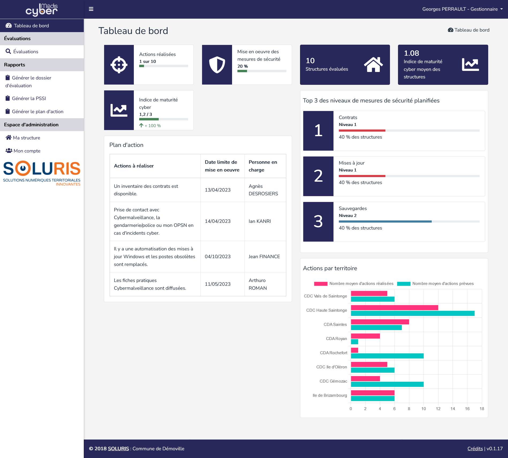

Plusieurs indicateurs sont disponibles :

* Le nombre d'actions réalisées et prévues dans la structure ;
* Le pourcentage des mesures de sécurité mise en œuvre dans la structure ;
* L'indice de maturité cyber de la structure ;
* La liste des actions à réaliser ;
* Le nombre de structures évaluées dans Madis Cyber ;
* L'indice de maturité cyber moyen des structures ;
* Le top 3 global des niveaux de mesures de sécurité planifiées ;
* Le nombre d'actions réalisées et prévues par territoire.

# Navigation générale

Il est possible de naviguer dans les différentes pages :
* « **Tableau de bord** » permet de piloter son niveau de maturité cyber ;
* « **Évaluations** » permet de consulter la liste des évaluations réalisées et d'en réaliser de nouvelles ;
* « **Générer le dossier dévaluation** » permet de générer le dossier d'évaluation de sa structure au format PDF (dernière évaluation) ;
* « **Générer la PSSI** » permet de générer la politique de sécurité de sa structure au format PDF (dernière évaluation) ;
* « **Générer le dossier dévaluation** » permet de générer le plan d'action de sa structure au format PDF (dernière évaluation) ;
* « **Ma structure** » permet de modifier les informations de sa structure. Les informations générales de la structure ne peuvent être modifiées que par un administrateur ;
* « **Mon compte** » permet de modifier les informations de son compte (prénom, nom, email, mot de passe). **L'adresse mail renseignée ne doit pas déjà avoir été utilisée par un autre compte**.

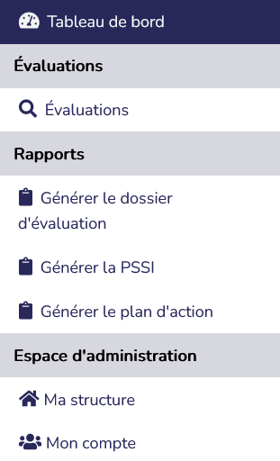

Dans le bandeau d'en-tête, le bouton « **☰** » permet d'agrandir ou de réduire le bandeau du menu.

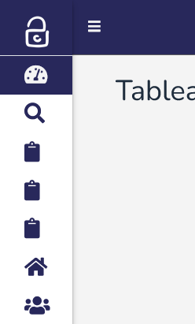

Dans le bandeau d'en-tête sont affichés le nom d'utilisateur et son rôle. Un sous-menu permet d'accéder à son profil ou de se déconnecter.

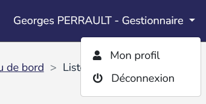

Le bouton « **Filtrer les colonnes** » permet de choisir les colonnes souhaitées dans l'affichage. Cette information est ensuite mémorisée dans le navigateur.

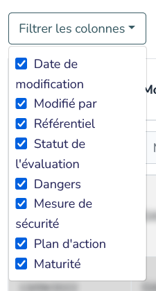

Les en-têtes de colonnes permettent de filtrer les résultats affichés dans la liste.

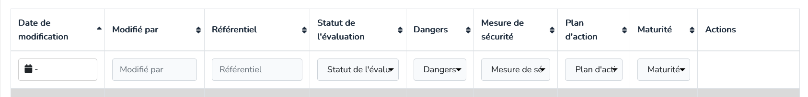

Le bouton « **Réinitialiser les filtres** » permet de remettre à l'origine les filtres des en-têtes de colonnes (affichage de tous les résultats).


D'une manière générale dans Madis Cyber, lorsque le nombre d'éléments à afficher est trop important, il est possible de naviguer entre les pages à l'aide des boutons de pagination situés à la suite d'un tableau.


# Les évaluations

Dans le menu « **Évaluations** », il est possible de consulter la liste des évaluations créées.

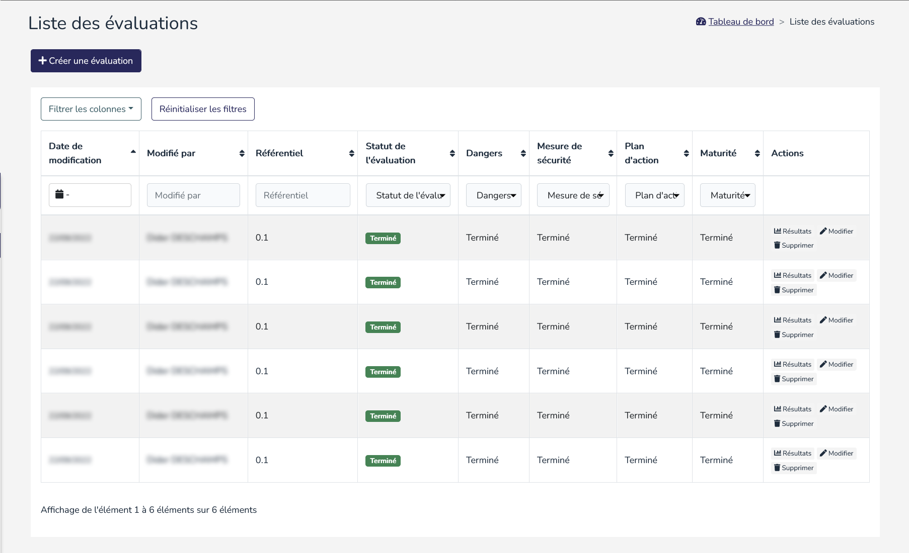

Il est possible d'effectuer plusieurs actions : 
- « **+ Créer une évaluation** » permet de débuter une nouvelle évaluation ;
- « **Résultats** » permet d'accéder aux résultats d'une évaluation terminée ;
- « **Modifier** » permet de modifier les informations d'une évaluation. **Modifier une évaluation terminée ou une étape terminée entraînera la suppression des données saisies aux étapes suivantes** ;
- « **Supprimer** » permet de supprimer définitivement l'évaluation. **Cette action est irréversible**.

Une évaluation va passer par plusieurs étapes :

- « **Étape 1 : Dangers** » permet de déterminer la criticité de chacun des dangers présentés ;
- « **Étape 2 : Mesures de sécurité** » permet de décrire les mesures de sécurité mises en place ;
- « **Étape intermédiaire : Synthèse des mesures de sécurité** » permet de voir graphiquement la vraisemblance de réussite des scénarios d'attaque suite aux éléments précédemment renseignés ;
- « **Étape 3 : Plan d'action** » permet de définir les actions à mettre en place ;
- « **Étape 4 : Mesurer la maturité cyber** » permet de déterminer son niveau de maturité cyber ;
- « **Résultats : Résultats de l’évaluation** »  synthétise toutes les informations et de produire un rapport.

Il est possible de naviguer entre les différentes étapes grâce au suivi des étapes. Une étape terminée peut être est modifiée via le bouton « **Modifier l'évaluation** », toutes les informations saisies dans les étapes suivantes sont alors réinitialisées.

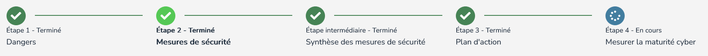

## Étape 1 : Dangers

Cette étape permet de déterminer la criticité de chacun des dangers présentés.

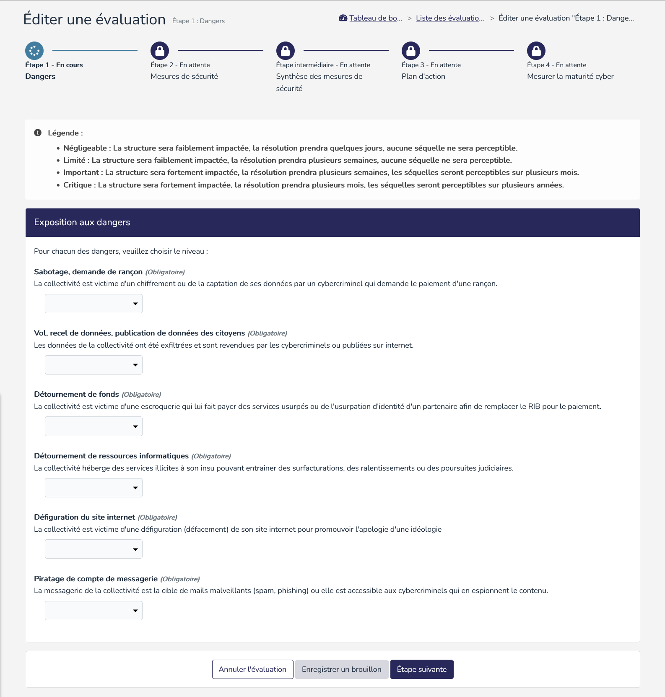

Pour chacun des dangers listés, indiquer la criticité parmi les propositions suivantes :

- **Négligeable** : La structure sera faiblement impactée, la résolution prendra quelques jours, aucune séquelle ne sera perceptible ;
- **Limité** : La structure sera faiblement impactée, la résolution prendra plusieurs semaines, aucune séquelle ne sera perceptible ;
- **Important** : La structure sera fortement impactée, la résolution prendra plusieurs semaines, les séquelles seront perceptibles sur plusieurs mois ;
- **Critique** : La structure sera fortement impactée, la résolution prendra plusieurs mois, les séquelles seront perceptibles sur plusieurs années.

Il est possible d'effectuer plusieurs actions :
- « **Annuler l'évaluation** » permet de quitter l'évaluation en ne prenant pas en compte les informations saisies ou modifiées. L'étape actuelle sera toujours en statut « En cours » ;
- « **Enregistrer un brouillon** » permet de quitter l'évaluation en enregistrant les informations saisies ou modifiées. L'étape actuelle sera toujours en statut « En cours »  ;
- « **Étape suivante** » permet de continuer l'évaluation en enregistrant les informations saisies ou modifiées. L'étape actuelle passera alors en statut « Terminé » et l'évaluation passera à l'étape suivante.

À noter que si l'étape est en lecture seule, le bouton « **Enregistrer un brouillon** » deviendra « **Modifier l'évaluation** » permettant de modifier l'étape. Cependant, si une étape est modifiée, toutes les informations saisies dans les étapes suivantes seront perdues.

## Étape 2 : Mesures de sécurité

Cette étape permet de décrire les mesures de sécurité mises en place. 

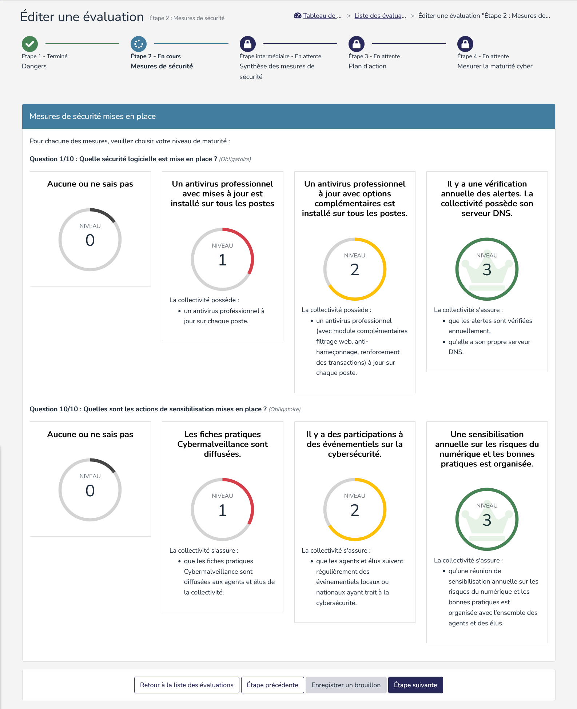

Pour chacune des mesures listées, indiquer le niveau de maturité cyber de votre structure parmi les propositions suivantes :

- **Niveau 0** : La structure n'a pas mis en place cette mesure ou ne sait pas ;
- **Niveau 1** : La structure a mis en place les éléments indiqués pour le niveau 1 ;
- **Niveau 2** : La structure a mis en place les éléments indiqués pour le niveau 1 et 2 ;
- **Niveau 3** : La structure a mis en place tous les éléments indiqués pour le niveau 1, 2 et 3.


## Étape intermédiaire : Synthèse des mesures de sécurité

Cette étape affiche une synthèse intermédiaire prenant en compte les éléments précédemment renseignés.

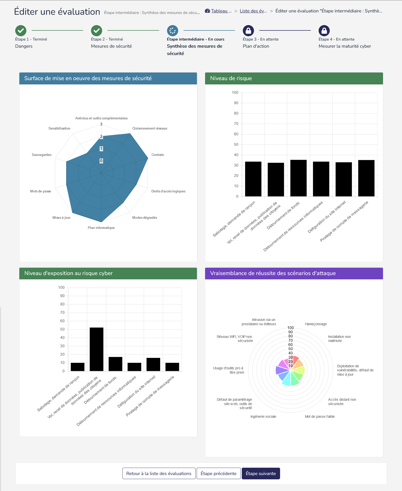


## Étape 3 : Plan d'action

Cette étape permet de définir les actions à mettre en place. 

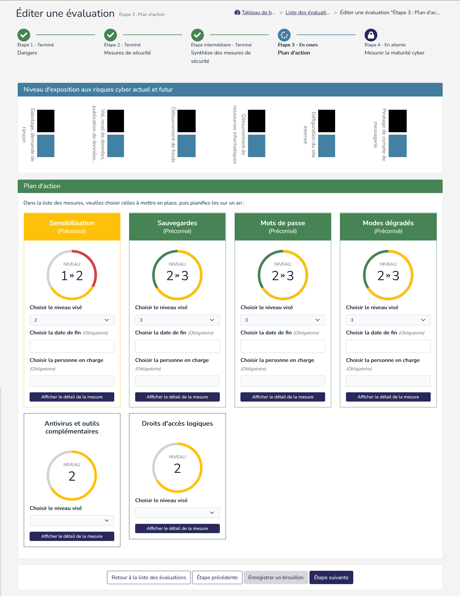

Pour chacune des mesures listées, indiquer celles à mettre en place en sélectionnant le niveau visé, puis indiquer la date de fin et la personne en charge. Par défaut, 4 mesures seront automatiquement préconisées.

## Étape 4 : Mesurer la maturité cyber

Cette étape est la dernière avant la fin de l'évaluation et la possibilité de produire un rapport. 

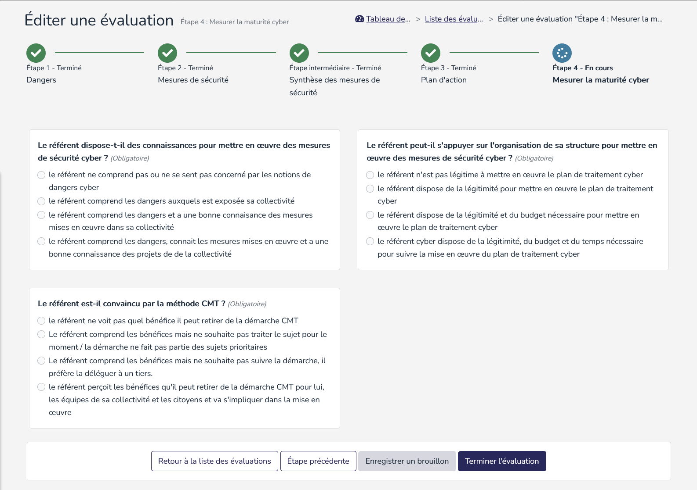

Pour chacune question, cocher la réponse adaptée à votre structure.

## Résultats : Résultats de l’évaluation

Cette étape permet de positionner son niveau de maturité cyber.

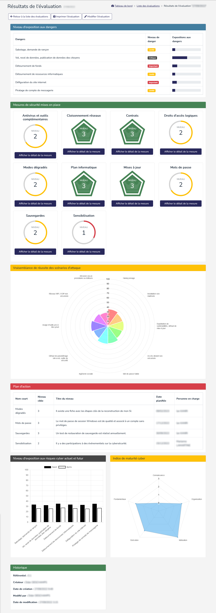

Plusieurs indicateurs sont disponibles :

* Le niveau d'exposition aux dangers ;
* La liste des mesures de sécurité mises en place actuellement ;
* La vraisemblance de réussite des scénarios d'attaque ;
* Le plan d'action des mesures de sécurité à réaliser ;
* Le niveau d'exposition aux risques cyber actuel et futur ;
* L'indice de maturité cyber de la structure.

Il est possible d'effectuer plusieurs actions :
- « **Retour à la liste des évaluations** » permet de quitter l'évaluation ;
- « **Imprimer l'évaluation** » permet de générer le dossier de l'évaluation au format PDF ;
- « **Modifier l'évaluation** » permet de modifier l'évaluation. L'étape 4 passera alors en statut « En cours ».

# Administration

Cette partie est réservée aux administrateurs de Madis Cyber.

## Tableau de bord administrateur

Le tableau de bord administrateur permet d'avoir des indications plus avancées sur l'utilisation de Madis Cyber sur les territoires accompagnés.

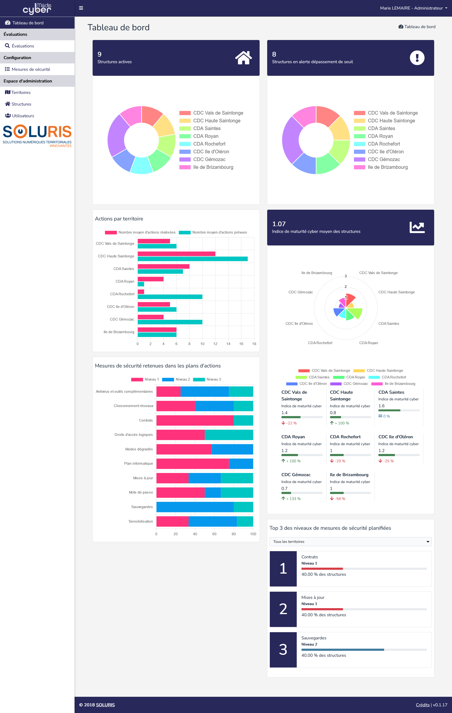

Plusieurs indicateurs sont disponibles :

* Le nombre total de structures actives et leur répartition par territoire ;
* Le nombre d'actions réalisées et prévues par territoire ;
* Le nombre de mesures de sécurité retenues dans les plans d'actions par niveau ;
* Le nombre total de structures en alerte dépassement de seuil et leur répartition par territoire ;
* L'indice de maturité cyber moyen des structures ;
* L'indice de maturité cyber moyen par territoire ainsi que son taux de variation en pourcentage ;
* Le top 3 des niveaux de mesures de sécurité planifiées. Par défaut, celui-ci comprend l'ensemble des territoires. Cependant, un champ de sélection permet d'afficher le top 3 d'un seul territoire.

## Gestion des mesures de sécurité

Dans le menu « **Mesures de sécurité** », il est possible de consulter la liste des mesures de sécurité utilisées dans Madis Cyber.

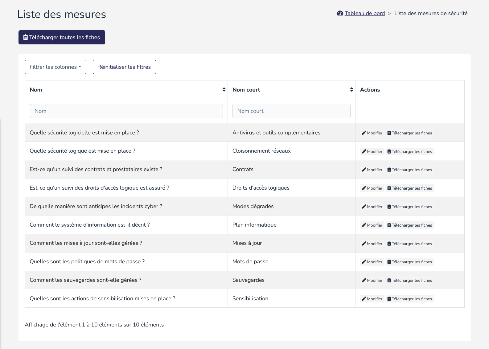

Il est possible d'effectuer plusieurs actions :
- « **Télécharger toutes les fiches** » permet de télécharger un dossier ZIP comprenant les fiches de tous les niveaux de maturité des 10 mesures de sécurité ;
- « **Modifier** » permet de modifier la mesure de sécurité. Il est possible de changer les fiches pour chaque niveau de maturité ainsi que d'apporter des précisions (Difficulté, Coût, Temps, Besoin d'accompagnement, ainsi que des informations pratiques). La taille maximale d'un fichier déposé est de 5 Mo et seuls les PDF sont autorisés ;
- « **Télécharger les fiches** » permet de télécharger un dossier ZIP comprenant les fiches de tous les niveaux de maturité d'une mesure de sécurité.

## Gestion des territoires

Dans le menu « **Territoires** », il est possible de consulter la liste des territoires créés dans Madis Cyber. Les structures doivent être rassemblées au sein de territoires.

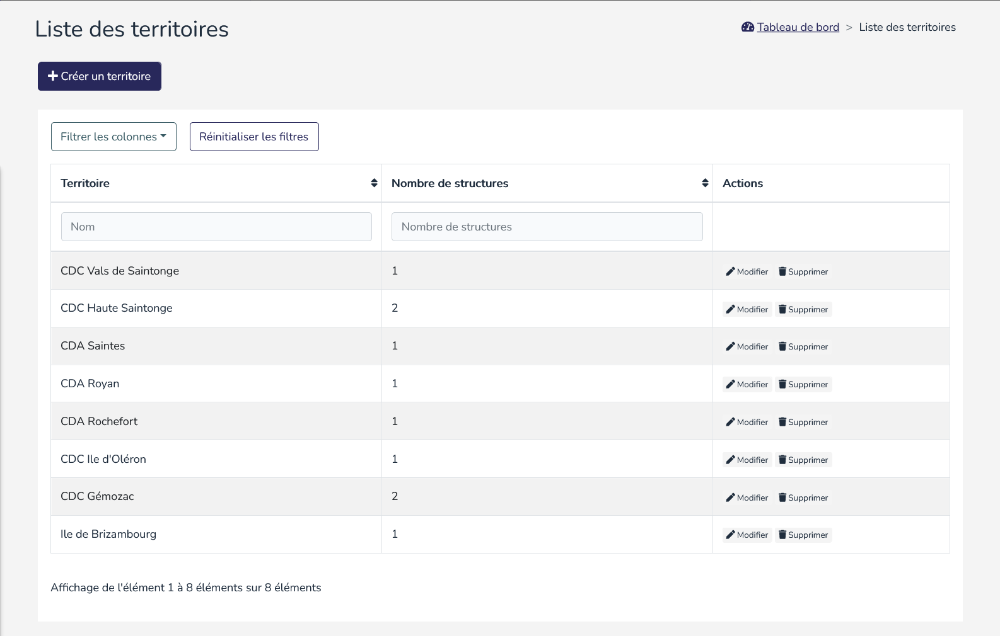

Il est possible d'effectuer plusieurs actions : 
- « **+ Créer un territoire** » permet d'ajout un nouveau territoire ;
- « **Modifier** » permet de modifier le nom du territoire ;
- « **Supprimer** » permet de supprimer définitivement le territoire. La suppression du territoire n'est possible que si celui-ci ne comprend aucune structure. **Cette action est irréversible**.

## Gestion des structures

Dans le menu « **Structures** », il est possible de consulter la liste des structures créées dans Madis Cyber.

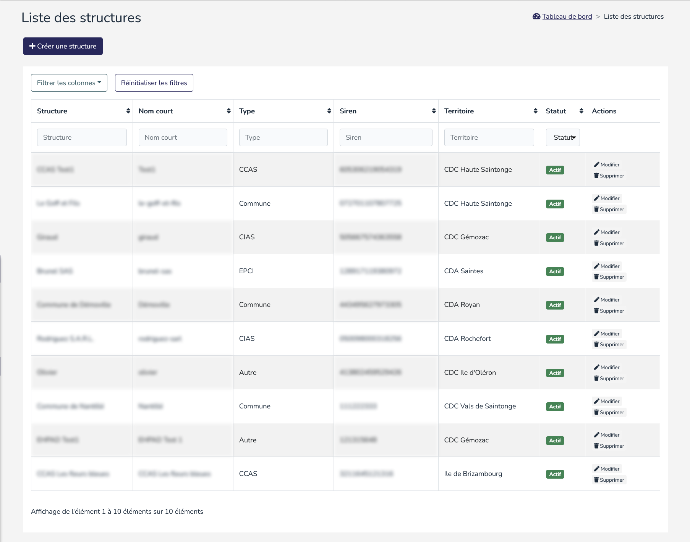

Il est possible d'effectuer plusieurs actions : 
- « **+ Créer une structure** » permet d'ajout une nouvelle structure ;
- « **Modifier** » permet de modifier les informations de la structure. Une structure inactive n'apparaîtra pas dans les statistiques et ses utilisateurs ne pourront plus se connecter à Madis Cyber ;
- « **Supprimer** » permet de supprimer définitivement la structure. La suppression de la structure entraîne la suppression de ses utilisateurs et de ses évaluations. **Cette action est irréversible**.

## Gestion des utilisateurs

Dans le menu « **Utilisateurs** », il est possible de consulter la liste des utilisateurs créés dans Madis Cyber.

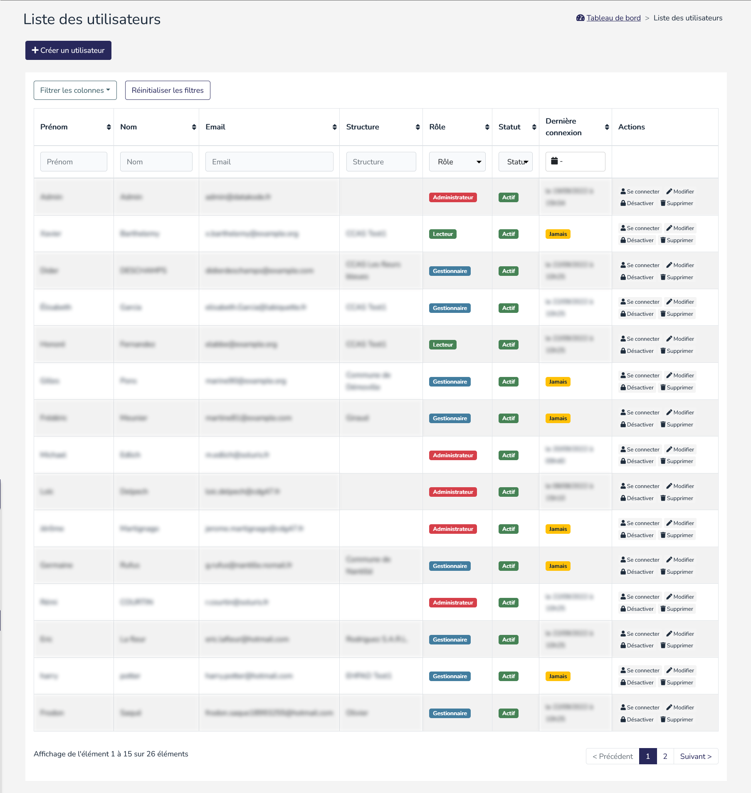

Il est possible d'effectuer plusieurs actions : 
- « **+ Créer un utilisateur** » permet d'ajout un nouvel utilisateur ;
- « **Se connecter** » permet d'accéder temporairement à la vue de l'utilisateur en se connectant en tant que celui-ci ;
- « **Modifier** » permet de modifier les informations comme le ferait l'utilisateur depuis son profil. De plus, il est également possible de changer le rôle et la structure de l'utilisateur, et de le rendre actif ou inactif ;
- « **Activer** » et « **Désactiver** » permet de rendre l'utilisateur actif ou inactif. Un utilisateur inactif ne pourra plus se connecter à Madis Cyber ;
- « **Supprimer** » permet de supprimer définitivement l'utilisateur. **Cette action est irréversible**.

Les différents rôles sont :

- **Lecteur** : L'utilisateur peut consulter les informations de sa structure. Il peut imprimer les résultats d'une évaluation et il peut générer le dossier d'évaluation, de la PSSI et du plan d'action. Il ne peut rien modifier, et il ne peut pas consulter les informations d'une évaluation en cours.
- **Gestionnaire** : L'utilisateur peut consulter et modifier toutes les informations concernant sa structure. Il peut imprimer les résultats d'une évaluation et il peut générer le dossier d'évaluation, de la PSSI et du plan d'action.
- **Administrateur** : L'utilisateur peut consulter et modifier toutes les informations des structures et utilisateurs. Cependant, n'étant pas rattaché à une structure, il ne peut pas réaliser une nouvelle évaluation, ni générer de dossier d'évaluation, de PSSI et de plan d'action. Il devra donc se connecter en tant qu'un gestionnaire de la structure souhaitée pour pouvoir réaliser une évaluation ou générer les documents.

## Paramètres de configuration

Variables d'environnement à configurer dans le fichier « **.env** » à la racine de Madis Cyber :

```
APP_NAME="Madis Cyber"
APP_ENV=prod
APP_KEY=
APP_DEBUG=false
APP_URL=http://localhost

LOG_CHANNEL=stack
LOG_DEPRECATIONS_CHANNEL=null
LOG_LEVEL=debug

DB_CONNECTION=mysql
DB_HOST=127.0.0.1
DB_PORT=3306
DB_DATABASE=soluris
DB_USERNAME=root
DB_PASSWORD=

BROADCAST_DRIVER=log
CACHE_DRIVER=file
FILESYSTEM_DISK=local
QUEUE_CONNECTION=sync
SESSION_DRIVER=file
SESSION_LIFETIME=120

MEMCACHED_HOST=127.0.0.1

REDIS_HOST=127.0.0.1
REDIS_PASSWORD=null
REDIS_PORT=6379

MAIL_MAILER=smtp
MAIL_HOST=mailhog
MAIL_PORT=1025
MAIL_USERNAME=null
MAIL_PASSWORD=null
MAIL_ENCRYPTION=null
MAIL_FROM_ADDRESS="hello@example.com"
MAIL_FROM_NAME="${APP_NAME}"

AWS_ACCESS_KEY_ID=
AWS_SECRET_ACCESS_KEY=
AWS_DEFAULT_REGION=us-east-1
AWS_BUCKET=
AWS_USE_PATH_STYLE_ENDPOINT=false

PUSHER_APP_ID=
PUSHER_APP_KEY=
PUSHER_APP_SECRET=
PUSHER_APP_CLUSTER=mt1

MIX_PUSHER_APP_KEY="${PUSHER_APP_KEY}"
MIX_PUSHER_APP_CLUSTER="${PUSHER_APP_CLUSTER}"

SANCTUM_STATEFUL_DOMAINS=localhost,127.0.0.1,127.0.0.1:8000,::1

ADMIN_EMAIL=admin@soluris.fr
ADMIN_FIRSTNAME=Admin
ADMIN_LASTNAME=Soluris
ADMIN_PASSWORD=secret

APP_FAVICON_PATH="Madis-Cyber-Logo.png"
REFERENTIEL_VERSION="1.3"
LOGO_SIDEBAR="logo-soluris.png"
FOOTER_LINK=https://www.soluris.fr/
```

# Annexes

## Glossaire

### Danger
Élément, personne, groupe de personnes ou organisation susceptible d’engendrer un **risque**.

### Cyberespace
Espace de communication constitué par l’interconnexion mondiale d’équipements de traitement automatisé de données numériques.

### Cybersécurité
État recherché pour un système d’information lui permettant de résister à des événements issus du **cyberespace** susceptibles de compromettre la disponibilité, l’intégrité ou la confidentialité des données stockées, traitées ou transmises et des services connexes que ces systèmes offrent ou qu’ils rendent accessibles. La cybersécurité fait appel à des techniques de sécurité des systèmes d’information et s’appuie sur la lutte contre la cybercriminalité et sur la mise en place d’une cyberdéfense.

### Indice de maturité cyber
L'indice de maturité cyber mesure le degré de **cybersécurité** dans la structure. Celui est compris entre 0 et 3. Plus le niveau est proche de 3, plus grandes sont les chances que la sécurité de l'information soit correctement intégrées dans la structure.

### La Méthode d'accompagnement
La méthode d'accompagnement s'adresse aux élus et aux décideurs des collectivités territoriales. Elle a pour objectif de permettre de mieux appréhender le phénomène des cybermenaces et de permettre d'agir simplement et efficacement pour contrer les dangers du cyberespace. Cette méthode s'intègre à l'application web Madis Cyber par le biais des 4 étapes présentes lors de la réalisation d'une évaluation.

### PSSI
La Politique de Sécurité des Systèmes d’Information (PSSI) est un plan d'actions définies pour maintenir un certain niveau de sécurité. Elle reflète la vision stratégique en matière de sécurité des **systèmes d'information** (SI). 

 ### Responsable Cybersécurité
Le responsable cybersécurité est un agent chargé d’animer dans les différents services de la structure, la mise en œuvre des principes cyber, et de rendre compte des actions auprès de l’**élu cybersécurité**. 

### Responsable Élu Cybersécurité

L’élu cybersécurité doit s’appuyer sur les compétences en place au sein de la structure pour la définition et la mise en œuvre opérationnelle de la politique cyber dans les services. L’élu cybersécurité doit s’appuyer sur le **RSSI**, ou lorsqu’il existe, sur l'agent ayant le rôle de **référent cybersécurité**.

L’implication d’un élu constitue un prérequis à la maîtrise de la cybersécurité, compte tenu de ses enjeux forts et de sa dimension transversale. Il permet d'engager la structure, en termes de responsabilité et de budget.

### Risque

**Danger** ou péril dans lequel l’idée de hasard est accusée, mais avec la perspective d’un quelconque avantage possible. Un risque est associé à la possibilité qu’un **danger connu** exploite un **scénario d’attaque connu** sur un **composant** et nuise à l’organisme.

### Risque cyber
**Risque** portant sur le **système d’information** ayant pour origine le **cyberespace**.

### Système d'Information (SI)
Ensemble des ressources destinées à collecter, classifier, stocker, gérer, diffuser les informations au sein d’une organisation.

----
**[Soluris](https://www.soluris.fr/)** 2 rue des Rochers, 17100 Saintes. Tel. 05 46 92 39 05 contact@soluris.fr
