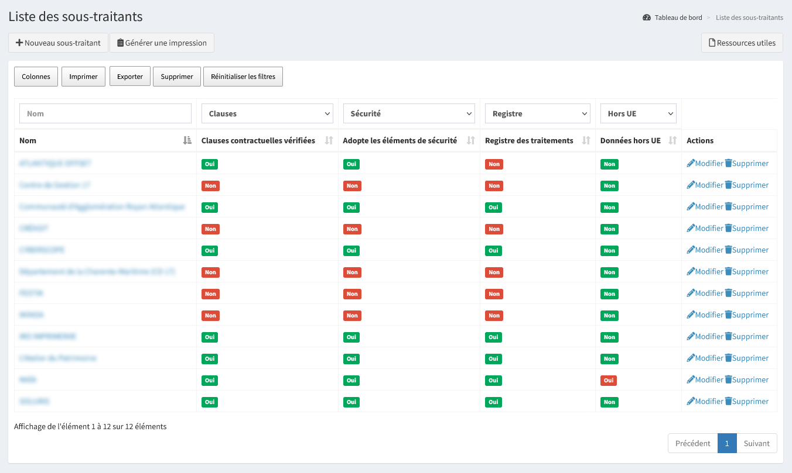
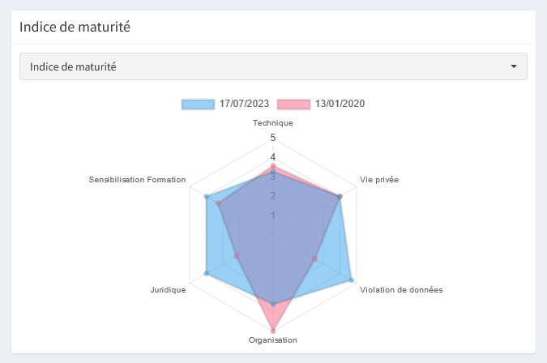
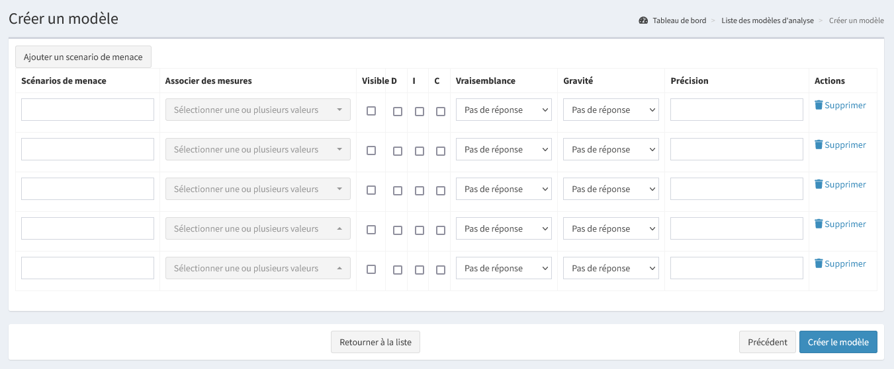
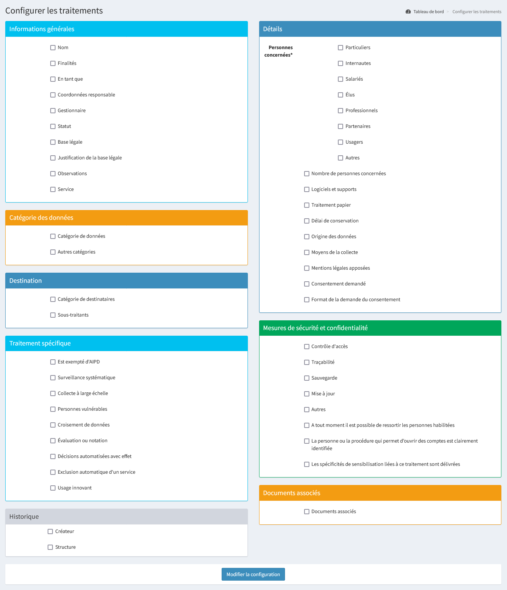
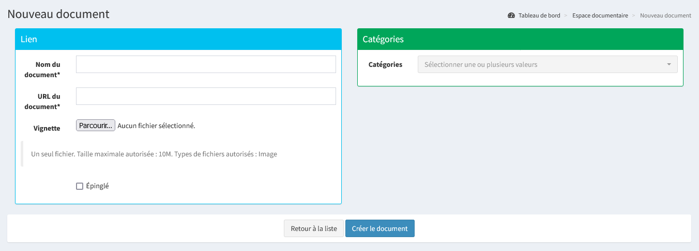
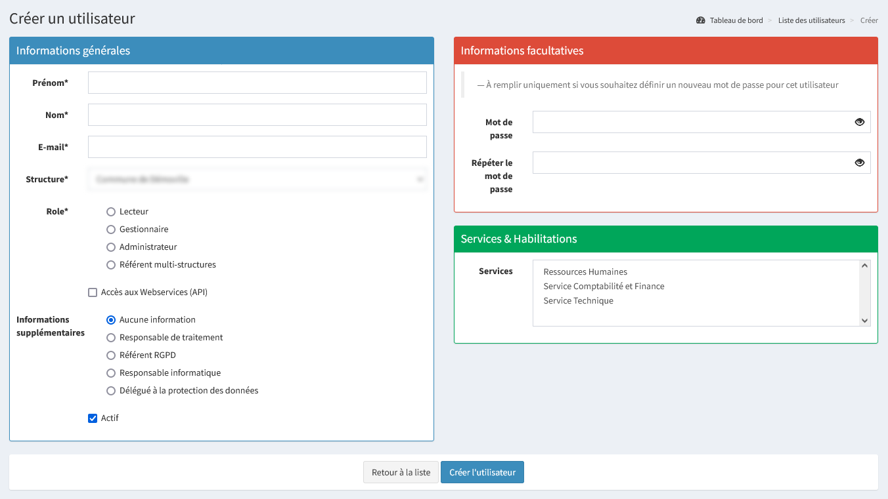

# Présentation

Madis est une application web OpenSource conçue par [Soluris](https://www.soluris.fr/) pour accompagner les structures à la mise en œuvre de leur conformité au RGPD.

Cette notice pourra évoluer en fonction des évolutions réglementaires, du logiciel et des besoins des structures.

## Se connecter à Madis

Madis est accessible depuis les navigateurs récents connectés à internet et sur la plupart des systèmes d'exploitation. L'interface est responsive et peut être consultée depuis tout client mobile tactile (préférer une tablette pour un confort d'affichage).

Pour se connecter, il est nécessaire d'avoir un compte (l'identifiant est l'adresse email).


Si le mot de passe a été oublié, il est possible de le régénérer en passant par « **Mot de passe oublié ?** ».

Par défaut, les règles de sécurité du mot de passe sont les suivantes :
* 14 caractères ;
* Au moins une lettre majuscule et minuscule ;
* Au moins un chiffre et un caractère spécial.

La case à cocher « **Se souvenir de moi** » permet de mémoriser la session dans le navigateur.

``À noter : Si le module de délégation de l'authentification est actif, une autre méthode d'authentification sera possible lors de la connexion.``

## Tableau de bord

Le tableau de bord permet de visualiser en un coup d’œil l’état d’avancement de la mise en conformité.


Il est possible de visualiser différents indicateurs :
* Les sous-traitants conformes et non conformes ;
* Les demandes à traiter et celles traitées ;
* Des statistiques et accès rapide de modules figurants également dans le menu ;
* Les deux derniers indices de maturité sous forme de radar. Il est possible de visualiser qu'un seul radar en cliquant sur la date de l'indice de maturité à masquer ainsi que de sélectionner un référentiel en particulier ;
* Le graphique synthétisant les mesures de sécurité conformes et non conformes sur les traitements informatisés ;
* La liste des prochaines actions planifiées dans le plan d'action ;
* D'autres indicateurs peuvent être affichés si les modules sont activés (Conformité des traitements, AIPD à réaliser...).

``Astuce : Les légendes et le détail des contenus sont affichés au survol de la souris.``

## Navigation générale

Il est possible de naviguer dans les différentes pages :
* Le menu « **Tableau de bord** » permet de piloter le niveau de conformité ;
* Le menu « **Traitements** » permet d'accéder à la gestion des traitements ;
* Le menu « **Sous-traitants** » permet d'accéder à la gestion des sous-traitants ;
* Le menu « **Demandes** » permet d'accéder à la gestion des demandes ;
* Le menu « **Violations** » permet d'accéder à la gestion des violations ;
* Le menu « **Documents** » permet d'accéder à la gestion des preuves (Contrat d’accompagnement, attestations de présences, politique de gestion des données...) ;
* Le menu « **Actions de protection** » permet d'accéder à la gestion de l’ensemble des actions de protection mises en place dans la structure ;
* Le menu « **Plan d'actions** » permet consulter la liste de l’ensemble des actions de protection planifiées ;
* Le menu « **Indice de maturité** » permet d'accéder à la gestion de l’évolution de la mise en conformité et de l'évaluer ;
* Le menu « **Générer un bilan** » permet de générer le bilan synthétisant l'ensemble des éléments renseignés dans Madis au format Word ;
* Le menu « **Espace documentaire** » permet de consulter toutes les ressources mises à disposition par le DPD ;
* Le menu « **Ma structure** » permet de modifier les informations de la structure ;
* Le menu « **Mon compte** » permet de modifier les informations du compte (prénom, nom, email, mot de passe...).


Dans le bandeau d'en-tête, le bouton « **☰** » permet d'agrandir ou de réduire le bandeau du menu.


Dans le bandeau d'en-tête, le nom d'utilisateur et le rôle sont affichés et permettent de se déconnecter.


Dans les différents registres et pages de Madis, il est possible de visualiser les informations d'un élément en cliquant sur son nom. Lors de la consultation de celui-ci, il est possible de consulter la liste des éléments associés. Un bouton d'action « **Imprimer** » permet d'imprimer les informations au format PDF.


Dans certaines pages, lorsqu'un élément est archivé ou inactif, il n'est plus visible dans la liste principale. Un bouton permet d'afficher les éléments archivés ou inactifs, un autre permet de revenir sur la liste des éléments actifs ou non archivés. Voici un exemple avec les traitements :

 

Le bouton « **Colonnes** » permet de choisir les colonnes souhaitées dans l'affichage. Cette information est ensuite mémorisée dans le navigateur.


Le bouton « **Exporter** » permet d'extraire dans un fichier Excel, la liste des éléments filtrés dans l'affichage.


Les en-têtes de colonnes permettent de filtrer les résultats affichés dans la liste.


Le bouton « **Réinitialiser les filtres** » permet de remettre à l'origine les filtres des en-têtes de colonnes (affichage de tous les résultats).


D'une manière générale dans Madis, lorsque le nombre d'éléments à afficher est trop important, il est possible de naviguer entre les pages à l'aide des boutons de pagination situés à la suite d'un tableau.


Dans les formulaires, les champs précédés d’un astérisque « * » sont obligatoires.

## Paramétrage : Ma structure

Le menu « **Ma structure** » permet de modifier les informations de la structure.

``À noter : À l'exception du site internet, du nombre de salariés et de la population, seul un administrateur peut modifier les informations générales et l’adresse.``


Il est possible de modifier les différents acteurs intervenants dans la mise en conformité (référent opérationnel, responsable de traitement, responsable informatique). Ces informations seront reprises dans le bilan.

* **Référent opérationnel** (ou Référent RGPD) : personne qui tient à jour les registres et anime la conformité RGPD en collaboration avec le DPD au sein de sa structure.
* **Référent informatique** : personne qui garantit l'organisation, le suivi ainsi que la gestion du système d'information.
* **Responsable de traitement** : personne responsable de la structure qui détermine les moyens et finalités d’un traitement.

Par défaut, les coordonnées du DPD sont celles du DPD mutualisé. Dans le cas où un DPD est désigné en interne, il faut cocher la case « **Différent du DPD moral** » et compléter ses coordonnées.


Les éléments « **Bilan paragraphe "Engagement de la direction"** » et « **Bilan paragraphe "Principe d'amélioration continue"** » permettent de personnaliser les paragraphes générés dans le bilan. Si ces champs sont laissés vides, des informations standards seront automatiquement renseignées dans le bilan.

L'élément « **Composition du comité Informatique et Libertés** » permet d'ajouter des membres qui seront repris dans le bilan.
Par défaut, le responsable de traitement et le référent opérationnel sont dans ce comité. Si un Responsable Informatique ou un DPD moral ont été définis, ils seront automatiquement ajoutés au comité.

L'élément « **Liste des utilisateurs** » permet de prendre connaissance des comptes utilisateurs de la structure. Il est important d'identifier et d'alerter son DPD si des comptes sont à désactiver.

## Paramétrage : Mon compte

Le menu « **Mon compte** » permet de modifier les informations du compte (prénom, nom, email, mot de passe) ainsi que d'afficher les droits. **L'adresse mail renseignée ne doit pas déjà avoir été utilisée par un autre compte**.


### Délégation de l'authentification (SSO)

Ce module permet de paramétrer Madis pour qu’il délègue son authentification à un système tiers.

Le module de délégation de l'authentification (SSO) est optionnel et peut être activé pour l'ensemble de Madis par le DPD (compte administrateur). Consulter l'[activation du module de délégation de l'authentification (SSO)](#activation-du-module-de-delegation-de-l-authentification-sso) pour plus d'information.

L’activation du module ajoute une nouvelle méthode d'authentification lors de la connexion ainsi que des éléments de paramétrage dans son profil permettant d'associer le compte à la délégation.


Pour utiliser cette méthode d'authentification, il est nécessaire d'associer son compte à un fournisseur d'identité en cliquant depuis son profil sur « **Associer le compte** ».


# Les registres

## Registre des traitements

Le menu « **Traitements** » permet de gérer les traitements. Le registre des traitements recense l’ensemble des traitements de données à caractère personnel de la structure.


Il est possible d'effectuer plusieurs actions : 

- « **+ Nouveau traitement** » permet d'ajouter un nouveau traitement ;
- « **Générer une impression** » permet de générer le registre des traitements au format Word ;
- « **Voir les traitements inactifs** » permet d'accéder aux traitements inactifs. Un traitement inactif n'apparaît pas dans le registre des traitements ni dans le bilan ;
- « **Exporter** » permet d'extraire la liste des éléments filtrés dans l'affichage au format Excel ;
- « **Modifier** » permet de modifier les informations d'un traitement ;
- « **Supprimer** » permet de supprimer définitivement le traitement. **Cette action est irréversible**.

Des cases à cocher permettent de réaliser des actions en masse sur les éléments sélectionnés :

- « **Imprimer** » permet de générer les traitements sélectionnés au format PDF ;

- « **Désactiver** » permet de rendre les traitements sélectionnés inactifs. Un traitement inactif n'apparaît pas dans le registre des traitements ni dans le bilan ;
- « **Supprimer** » permet de supprimer les traitements sélectionnés. **Cette action est irréversible**.

``Astuce : Il est possible de visualiser les informations d'un traitement en cliquant sur son nom. Lors de la consultation de celui-ci, un bouton d'action « Imprimer » permet d'imprimer les informations du traitement au format PDF. De plus, une zone d'information permet de consulter les préconisations renseignées par le Délégué à la Protection des Données (DPD).``

### Nouveau traitement

« **+ Nouveau traitement** » permet d'ajouter un nouveau traitement.

**Pour rappel, dans le formulaire, les champs précédés d’un astérisque « * » sont obligatoires.**


``Astuce : Dans la gestion des demandes, des violations, des preuves et des actions de protection, il est possible de les lier à un traitement.``

#### Informations générales

Dans les informations générales, il est possible de renseigner les éléments suivants :

* **Nom** : Intitulé du traitement ;
* **Finalités** : Précise l'objectif du traitement et ses fonctions. Par exemple, pour une activité de formation des personnels, il peut être renseigné : « Suivi des demandes et des périodes de formations effectuées, organisation des sessions et évaluation des connaissances » ;
* **En tant que** : Précise si le traitement est effectué en tant que **[responsable de traitement](#responsable-de-traitement)**, en tant que **[sous-traitant](#sous-traitant)** ou lorsque la **[responsabilité est conjointe](#responsables-conjoints)**. Selon le choix, il est possible de renseigner ses coordonnées ;
* **Gestionnaire** : Personne(s) ou service qui gère le traitement. Peut-être différent du responsable de traitement ou du référent opérationnel ;
* **Statut** : Le statut actif est coché par défaut. Un traitement inactif n'apparaît pas dans le registre des traitements ni dans le bilan ;
* **Base légale** : Liste des bases légales énumérées dans le RGPD. Il est possible de positionner la base légale sur « **À déterminer** » si la base légale n'est pas connue au moment de la création du traitement ;
* **Justification de la base légale** : Toute base légale doit être justifiée grâce à des références de texte réglementaire (Exemple CGCT). Par exemple, pour le consentement, il faut avoir l'accord écrit de la personne concernée. Il est également possible d'indiquer le texte réglementaire permettant de justifier le choix du délai de conservation ;
* **Observations** : Toute précision complémentaire sur la tenue de ce traitement ;
* **Registre public** : Rend visible le traitement dans une page non authentifiée à destination du grand public. Les champs affichés sont ceux [paramétrés par le DPD](#registre-public).

Ci-après un exemple d’informations générales pré-rempli :


#### Catégories de données

Dans les catégories de données, il est possible de renseigner les éléments suivants :

* **Les catégories de données** : Précise toutes les catégories de données concernées par le traitement. Les données sensibles sont précisées en gras dans la liste :
	- Santé ;
	- Numéro de Sécurité Sociale ;
	- Appartenance Syndicale ;
	- Opinion politique ou religieuse ;
	- Origine raciale ou ethnique ;
	- Vie sexuelle ;
* **Autres catégories** : Champ de texte libre pour préciser toute catégorie de donnée supplémentaire.

#### Destination

Dans la destination, il est possible de renseigner les éléments suivants :

* **Catégorie de destinataires** : Précise les destinataires des données à caractère personnel (service interne, organisation extérieure, partenaires...) ;
* **Sous-traitants** : Liste des sous-traitants identifiés dans le registre des sous-traitants.

``Astuce : Recenser un sous-traitant avant un traitement permet de le rattacher directement au moment de la création du traitement.``

#### Traitement spécifique

Un ou plusieurs traitements spécifiques vont peut-être conditionner une analyse d’impact, notamment s‘ils sont croisés avec des données sensibles. Il est possible de renseigner les éléments suivants :
* **Est exempté d'AIPD** : Si le traitement est exempté, il n'y aura pas d'indication alertant de la nécessité de réaliser une AIPD. Il est cependant toujours possible d'en réaliser une si souhaité ;
* **Surveillance systématique de personnes** : Par exemple, télésurveillance... ;
* **Collecte à large échelle** : Vise à traiter un volume considérable de données à caractère personnel, par exemple au niveau régional... ;
* **Personnes vulnérables** : Personnes âgées, enfant de moins de 15 ans, personne en situation de handicap, patients, employés... ;
* **Croisement de données** : Croisement ou combinaison d’ensemble de données ;
* **Évaluation ou notation** : Possibilité d'utiliser des données pour évaluer, noter, prédire ou établir le profil d'une personne sur des aspects concernant le rendement au travail, la santé, la situation économique, les préférences, le comportement... ;
* **Décisions automatisées avec effet** : Décision automatique sans supervision humaine pouvant par exemple, exclure ou discriminer une personne d'un droit ;
* **Exclusion automatique d'un service** : Décision automatique sans supervision humaine excluant à l'accès à un service ou à un contrat ;
* **Usage innovant** : Les conséquences de l'utilisation de cette nouvelle technologie ne sont pas toutes connues et peuvent à l'avenir devenir une nouvelle source de collecte de données personnelles pouvant porter atteinte aux droits et libertés individuelles.

#### Détails

Dans les détails, il est possible de renseigner les éléments suivants :

* **Personnes concernées** : Type de personnes concernées par le traitement. Il est possible de cocher la case correspondante et de préciser les informations par le champ de texte adjacent ;
* **Nombre de concernés** : Nombre approximatif de personnes concernées par le traitement. Cette information est utile en cas de violations de données personnelles ;
* **Logiciel et supports** : Si le traitement est informatisé, précise le nom du logiciel utilisé (Word, Excel...). Si le traitement est exclusivement papier, laisser ce champ vide ;
* **Traitement papier** : Si le traitement est papier ;
* « **+ Délai de conservation** » permet d'ajouter un ou plusieurs délais de conservation. Pour chacun, il est possible de renseigner les éléments suivants :
  * **Nom** :  Intitulé du délai de conservation ;
  * **Durée** :  Durée réelle mise en œuvre par la structure. Si la durée est calculée, préciser les critères utilisés pour déterminer le délai de conservation (Exemple : 3 ans à compter de la fin de la relation contractuelle) ;
  * **Sort final** : Sort final appliqué à l'issue du délai de conservation ;

* **Origine des données** : Données provenant d'un tiers (CAF, Société...) ou de la personne concernée directement ;
* **Moyens de la collecte** : Moyen utilisé pour collecter les données à caractère personnel ;
* **Mentions légales apposées** : Si les mentions légales sont indiqués ;
* Si la base légale du traitement est le consentement, il est possible de renseigner les éléments suivants :
  * **Consentement demandé** : Si le consentement est demandé ;
  * **Format de la demande du consentement**.


#### Mesures de sécurité et confidentialité

Les mesures de sécurité sont propres à chaque traitement concerné, il est possible de renseigner les éléments suivants :

* **Contrôle d'accès** : Par exemple, accès via un identifiant/mot de passe ou une certification, une gestion des habilitations, un badge... ;
* **Traçabilité** : Par exemple, journalisation des accès utilisateurs, données enregistrées (identifiant, date et heure de connexion, actions...) ;
* **Sauvegarde** : Type de sauvegarde (support, interne/externe, fréquence...) ;
* **Mise à jour** : Par exemple, configuration des mises à jour automatique, contrat de mise à jour... ;
* **Autres** : Précise toute autre mesure à documenter. Les quatre mesures précédentes concernent principalement les traitements informatisés, il est possible d'utiliser ce champ pour la protection des traitements papier. Par exemple, documents stockés dans un coffre-fort, armoire ignifugée fermant à clé...

Les éléments suivants doivent être cochés dans les cas suivants :
* S'il est possible de ressortir à tout moment les personnes habilitées ayant un accès aux données à caractère personnel ;
* Si la personne et/ou la procédure permettant d’ouvrir des comptes sont clairement identifiées ;
* Si les personnes pouvant avoir accès aux données ont été sensibilisées à la protection des données. Il peut également arriver que le traitement nécessite une sensibilisation spécifique.

## Registre des sous-traitants

Le menu « **Sous-traitants** » permet de consulter la liste des sous-traitants et d'en ajouter. Le registre des sous-traitants recense l’ensemble des sous-traitants de la structure et permet d’effectuer le suivi de leur conformité au RGPD (clauses contractuelles vérifiées, conforme au RGPD).

Un sous-traitant est un prestataire de services qui traite des données à caractère personnel pour le compte, sur l'instruction et sous l’autorité de la structure en tant que responsable de traitement.



Il est possible d'effectuer plusieurs actions : 

- « **+ Nouveau sous-traitant** » permet d'ajouter un nouveau sous-traitant ;
- « **Générer une impression** » permet de générer le registre des sous-traitants au format Word ;
- « **Imprimer** » permet de générer les éléments filtrés dans l'affichage au format PDF ;
- « **Exporter** » permet d'extraire la liste des éléments filtrés dans l'affichage au format Excel ;
- « **Supprimer** » permet de supprimer les éléments filtrés dans l'affichage. **Cette action est irréversible** ;
- « **Modifier** » permet de modifier les informations d'un sous-traitant ;
- « **Supprimer** » permet de supprimer définitivement le sous-traitant. **Cette action est irréversible**.

``Astuce : Il est possible de visualiser les informations d'un sous-traitant en cliquant sur son nom. Lors de la consultation de celui-ci, un bouton d'action « Imprimer » permet d'imprimer les informations du sous-traitant au format PDF.``

### Nouveau sous-traitant

« **+ Nouveau sous-traitant** » permet d'ajouter un nouveau sous-traitant.

**Pour rappel, dans le formulaire, les champs précédés d’un astérisque « * » sont obligatoires.**


``Astuce : Recenser un sous-traitant avant un traitement permet de le rattacher directement au moment de la création du traitement.``

#### Informations générales

Dans les informations générales, il est possible de renseigner les éléments suivants :

* **Nom** : Intitulé du sous-traitant ;
* **Agent référent** : Personne en charge de gérer les relations avec ce sous-traitant ;
* **Clauses contractuelles vérifiées** : Les clauses contractuelles de ce contrat ont été vérifiées et sont conformes au RGPD ;
* **A adopté les éléments de sécurité nécessaires** : Suite à une demande ou à une vérification, le sous-traitant a adopté les mesures de sécurité jugées suffisantes ;
* **Tient à jour un registre des traitements** : Le registre de traitement du sous-traitant a été communiqué et est tenu à jour ;
* **Envoi des données hors UE** : Les données sont envoyées en dehors de l'Union Européenne.

#### DPD

Dans le cas où le sous-traitant a désigné un DPD, il faut cocher la case « **Le sous-traitant a désigné un DPD** » et compléter ses coordonnées.

#### Coordonnées

Dans les coordonnées, il est possible de renseigner les éléments suivants :

* **Prénom** ;
* **Nom** ;
* **Adresse** ;
* **Compl. adresse** ;
* **Code postal** ;
* **Ville** ;
* **Pays** ;
* **Email** ;
* **N° de tel**.

## Registre des demandes

Le menu « **Demandes** » permet de consulter la liste des demandes et d'en ajouter. Chaque nouvelle demande d'exercice de droit de personne concernée basé sur le RGPD (droit d’accès, d’opposition...) doit être enregistrée dans ce registre.


Il est possible d'effectuer plusieurs actions :

- « **+ Nouvelle demande** » permet d'ajouter une nouvelle demande ;
- « **Générer une impression** » permet de générer le registre des demandes au format Word ;
- « **Voir les traitements archivés** » permet d'accéder aux demandes archivées. Une demande archivée n'apparaît pas dans le registre des demandes ni dans le bilan ;
- « **Imprimer** » permet de générer les éléments filtrés dans l'affichage au format PDF ;
- « **Exporter** » permet d'extraire la liste des éléments filtrés dans l'affichage au format Excel ;
- « **Modifier** » permet de modifier les informations d'une demande ;
- « **Archiver** » permet d'archiver une demande. Une demande archivée n'apparaît pas dans le registre des demandes ni dans le bilan.

``Astuce : Il est possible de visualiser les informations d'une demande en cliquant sur le nom de la personne concernée. Lors de la consultation de celle-ci, un bouton d'action « Imprimer » permet d'imprimer les informations de la demande au format PDF.``

### Nouvelle demande

« **+ Nouvelle demande** » permet d'ajouter une nouvelle demande.

**Pour rappel, dans le formulaire, les champs précédés d’un astérisque « * » sont obligatoires.**


#### Demande

Dans la demande, il est possible de renseigner les éléments suivants :

* **Objet de la demande** : Type de demande formulée ;
* **Demande explicite** : Précise les éléments manquants ;
* **Date de la demande** : Date de la réception de la demande  ;
* **Motif** : Objet de la demande ;
* **Demande complète** : Le formulaire de demande est correctement rempli et accompagné des justificatifs ;
* **Demandeur légitime** : La personne concernée est la personne qui fait la demande ou est le tuteur dûment habilité à faire la demande, ou possède un mandat de la personne concernée ;
* **Demande légitime** : La demande repose sur une base légale pertinente et proportionnée.

#### Réponse

Lorsque la réponse est délivrée au demandeur, il est possible de renseigner les éléments suivants :

* **État de la demande** : Statut de la demande ;
* **Réponse apportée** : Message apporté au demandeur ;
* **Date de la réponse** : Date d'envoi de la réponse ;
* **Moyen de la réponse** : Méthode utilisée pour répondre au demandeur (mail, courrier postal, remis en main propre).

**Rappel : La réponse doit être délivrée dans un délai maximum d'un mois ([Art. 12 du RGPD](https://www.cnil.fr/fr/reglement-europeen-protection-donnees/chapitre3#Article12)).**

#### Demandeur

Dans le demandeur, il est possible de renseigner les éléments suivants :

* **Civilité** ;
* **Prénom** ;
* **Nom** ;
* **Adresse** ;
* **Email** ;
* **N° de téléphone** ;

Par défaut, la case « **Est la personne concernée** » est cochée, cependant, dans le cas où le demandeur est différent de la personne concernée, il faut la décocher et compléter les coordonnées de l'élément « [**Personne concernée**](#personne-concernee) ».

#### Personne concernée

Dans le cas où le demandeur serait différent de la personne concernée, il faut décocher la case « **Est la personne concernée** » présente dans l'élément « [**Demandeur**](#demandeur) » et compléter ses coordonnées.

#### Traitements associés

Il est possible d'associer une demande à un ou plusieurs traitements.

## Registre de violations

Le menu « **Violations** » permet de consulter la liste des violations et d'en ajouter. Le registre des violations recense l’ensemble des violations de la structure.

Une violation de données est un incident de sécurité, d’origine malveillante ou non, intentionnel ou non, et qui risque de compromettre l’intégrité, la confidentialité ou la disponibilité de données personnelles.


Il est possible d'effectuer plusieurs actions :

- « **+ Nouvelle violation** » permet d'ajouter une nouvelle violation ;
- « **Générer une impression** » permet de générer le registre des violations au format Word ;
- « **Voir les violations archivées** » permet d'accéder aux violations archivées. Une violation archivée n'apparaît pas dans le registre des violations ni dans le bilan ;
- « **Imprimer** » permet de générer les éléments filtrés dans l'affichage au format PDF ;
- « **Exporter** » permet d'extraire la liste des éléments filtrés dans l'affichage au format Excel ;
- « **Modifier** » permet de modifier les informations d'une violation ;
- « **Archiver** » permet d'archiver une violation. Une violation archivée n'apparaît pas dans le registre des violations ni dans le bilan.

``Astuce : Il est possible de visualiser les informations d'une violation en cliquant sur la date de violation. Lors de la consultation de celle-ci, un bouton d'action « Imprimer » permet d'imprimer les informations de la violation au format PDF.``

### Nouvelle violation

« **+ Nouvelle violation** » permet d'ajouter une nouvelle violation.

**Pour rappel, dans le formulaire, les champs précédés d’un astérisque « * » sont obligatoires.**


#### Informations générales

Dans les informations générales, il est possible de renseigner les éléments suivants :

* **Date de la violation** : Date de la constatation de la violation. Par défaut, elle se mettra sur la date à laquelle la violation est ajoutée ;
* **La violation est toujours en cours** : Précise si la violation est toujours en cours. Lorsque la violation sera terminée, cette case devra être décochée ;
* **Nature de la violation** : Type de violation de DIC (Disponibilité ; Intégrité ; Confidentialité) ;
* **Origine de la perte de données** ;
* **Cause de la violation** ;
* **Nature des données concernées** ;
* **Catégorie des personnes concernées** ;
* **Nombre approximatif d'enregistrements concernés par la violation** ;
* **Nombre approximatif de personnes concernées par la violation**.

#### Conséquences de la violation

Dans les conséquences de la violation, il est possible de renseigner les éléments suivants :

* **Nature des impacts potentiels pour les personnes** ;
* **Niveau de gravité** ;
* **Communications aux personnes concernées** ;
* **Précisions sur les communications** : Précise les éléments de communication employés pour prévenir les personnes concernées ;
* **Mesures techniques et organisationnelles appliquées suite à la violation** ;
* **Notification** ;
* **Précisions sur les notifications** ;
* **Commentaire** : Toute précision complémentaire sur les conséquences de la violation.

**Rappel : En cas de risque pour les personnes concernées, une notification à la CNIL doit être faite dans les 72 heures en plus de l'enregistrement en interne. De plus, en cas de risque élevé, les personnes concernées devront également être notifiées ([Art. 33 et 34 du RGPD](https://www.cnil.fr/fr/reglement-europeen-protection-donnees/chapitre4#Article33)).**

#### Traitements associés

Il est possibilité d'associer une violation à un ou plusieurs traitements.

#### Sous-traitants associés

Il est possibilité d'associer une violation à un ou plusieurs sous-traitants.

# Gestion de la preuve

Le menu « **Documents** » permet de consulter la liste des preuves et d'en ajouter. Cette liste recense l’ensemble des actions mises en place ou à mettre en place.

Afin de prouver la conformité de la structure, un dossier documentaire doit être constitué pour permettre de démontrer que le traitement des données personnelles est conforme au règlement (Contrat d’accompagnement à la délégation à la protection des données, attestations de présences, politique de gestion des données...).


Il est possible d'effectuer plusieurs actions :

- « **+ Ajouter une preuve** » permet d'ajouter une nouvelle preuve ;
- « **Voir les preuves archivées** » permet d'accéder aux preuves archivées. Une preuve archivée n'apparaît pas dans le téléchargement de tous les documents ni dans le bilan ;
- « **Télécharger tous les documents** » permet de télécharger dans un dossier ZIP, tous les documents déposés comme preuve ;
- « **Exporter** » permet d'extraire la liste des éléments filtrés dans l'affichage au format Excel ;
- « **Télécharger** » permet de télécharger le document déposé comme preuve ;
- « **Modifier** » permet de modifier les informations d'une preuve ;
- « **Supprimer** » permet de supprimer définitivement la preuve. **Cette action est irréversible**.

## Nouvelle preuve

« **+ Ajouter une preuve** » permet d'ajouter une nouvelle preuve.

**Pour rappel, dans le formulaire, les champs précédés d’un astérisque « * » sont obligatoires.**


### Informations générales

Dans les informations générales, il est possible de renseigner les éléments suivants :

* **Nom** : Intitulé de la preuve ;
* **Type** : Type de preuve ;
* **Commentaire** : Toute précision complémentaire sur la preuve.

### Document

Un seul fichier peut être déposé à la fois et d'une taille maximale définie dans l'administration.

Les fichiers autorisés sont :

- Images : .jpg, .jpeg, .png ;
- Documents : .pdf, .doc, .docx, .odt, .ppt, .pptx, .xls, .xlsx, .xlsm, ods.

### Association

Il est possible d'associer la preuve à un ou plusieurs éléments du registre des traitements, des sous-traitants, des demandes, des violations, ainsi qu'à des actions de protections.

# Les actions de protection

Le menu « **Actions de protection** » permet de consulter la liste des actions de protection et d'en ajouter. Cette liste recense l’ensemble des actions mises en place ou à mettre en place.

Les actions de protection sont des mesures (techniques, organisationnelles, juridiques...) mises en place ou à mettre en place dans la structure.


Il est possible d'effectuer plusieurs actions :

- « **+ Nouvelle action** » permet d'ajouter une nouvelle action ;
- « **Générer une impression** » permet de générer le registre des actions de protection au format Word ;
- « **Imprimer** » permet de générer les éléments filtrés dans l'affichage au format PDF ;
- « **Exporter** » permet d'extraire la liste des éléments filtrés dans l'affichage au format Excel ;
- « **Supprimer** » permet de supprimer les éléments filtrés dans l'affichage. **Cette action est irréversible** ;
- « **Modifier** » permet de modifier les informations d'une action de protection ;
- « **Supprimer** » permet de supprimer définitivement l'action de protection. **Cette action est irréversible**.

``Astuce : Il est possible de visualiser les informations d'une action de protection en cliquant sur son nom. Lors de la consultation de celle-ci, un bouton d'action « Imprimer » permet d'imprimer les informations de l'action au format PDF.``

## Nouvelle action de protection

« **+ Nouvelle action** » permet d'ajouter une nouvelle action de protection.

**Pour rappel, dans le formulaire, les champs précédés d’un astérisque « * » sont obligatoires.**


### Informations générales

Dans les informations générales, il est possible de renseigner les éléments suivants :

* **Nom** : Intitulé de l'action de protection ;
* **Description** : Description brève permettant de comprendre l'action ;
* **Responsable d'action** : Personne(s) ou service chargé de faire en sorte que l'action soit mise en place ;
* **Priorité** : Possibilité de prioriser certaines actions avec trois niveaux de priorité (Basse, Normale et Haute) ;
* **Coût** : Montant estimé pour réaliser l'action. Peut être nul, ou peut demander un arbitrage ou une planification plus longue ;
* **Charge** : Temps passé pour effectuer l’action.

### Application

Dans l'application, il est possible de renseigner les éléments suivants :

* **Statut** : Statut de l'action de protection. Une fois l'action entièrement réalisée, il faudra passer le statut de « **Non appliquée** » à « **Appliquée** ». Une action non réalisable doit avoir le statut « **Non applicable** » ;
* **Échéance** : Date d'échéance de l'action pour la planifier. Si le statut de l'action de protection est « **Non appliquée** » et qu'elle est planifiée, elle apparaîtra alors dans le [plan d'actions](#plan-dactions) ;
* **Observations** : Toute précision complémentaire sur la planification de l'action.

### Éléments liés

Il est possible d'associer une action de protection à un ou plusieurs éléments du registre des traitements, des sous-traitants, des demandes ou des violations.

# Plan d’actions

Le menu « **Plan d'actions** » permet de consulter la liste des actions de protection planifiées. Le plan d’actions recense l’ensemble des mesures planifiées permettant de budgétiser et d'évaluer les charges en jour/homme.

Un plan d'actions reflète les décisions prises dans le but d’améliorer la mise en conformité au RGPD. Pour aiguiller dans l’élaboration de celui-ci, il est possible de s'appuyer sur les thèmes prioritaires mis en exergue suite à la réalisation de l'[indice de maturité](#indice-de-maturite) de la structure.


Il est possible d'effectuer plusieurs actions :

- « **Exporter** » permet d'extraire la liste des éléments filtrés dans l'affichage au format Excel ;
- « **Voir l'action de protection** » permet de visualiser les informations d'une action de protection.

``Astuce : Il est possible de trier les actions par date/coût/charge...``

Pour ajouter une action au plan d'actions, il faut aller dans la [liste des actions de protection](#les-actions-de-protection) et passer le **statut de l'action** en « **Non appliquée** » et renseigner une **date prévisionnelle**.

# Indice de maturité

Le menu « **Indice de maturité** » permet de consulter la liste des indices de maturité et d'en ajouter. Cette liste recense la progression du niveau de maturité de la structure selon différents référentiels mis à disposition par le Délégué à la Protection des Données (DPD).

L’indice de maturité est une suite de questions, classées par thématiques permettant de suivre l’évolution de la mise en conformité de la structure. Outil d’aide à la décision, il permet ainsi de mettre en exergue les thèmes prioritaires à développer. Il est le repère indispensable pour aiguiller dans l’élaboration du [plan d'actions](#plan-dactions).


Il est possible d'effectuer plusieurs actions :

- « **+ Nouvel indice de maturité** » permet d'ajouter un nouvel indice de maturité ;
- « **Imprimer** » permet de générer un indice de maturité au format Word ;
- « **Synthèse** » permet de visualiser la synthèse d'un indice de maturité ;
- « **Modifier** » permet de modifier les informations d'un indice de maturité ;
- « **Supprimer** » permet de supprimer définitivement l'indice de maturité. **Cette action est irréversible**.

``Astuce : Il est possible de visualiser la synthèse d'un indice de maturité en cliquant sur son nom. Lors de la consultation de celle-ci, un bouton d'action « Imprimer » permet d'imprimer les informations de l'indice de maturité au format Word. Des préconisations peuvent être présentes, et pour chacune, il est possible d'affecter une ou plusieurs actions de protection. Celles-ci peuvent être choisies dans la liste ou ajoutées avec le bouton « + ».``


## Nouvel indice de maturité

« **+ Nouvel indice de maturité** » permet d'ajouter un nouvel indice de maturité. 

**Pour rappel, dans le formulaire, les champs précédés d’un astérisque « * » sont obligatoires.**

### Choix du référentiel

L’évaluation d’un indice de maturité commence par le choix du référentiel.


Il est possible d'effectuer plusieurs actions :

- « **Retourner à la liste** » permet de quitter l'indice de maturité en ne prenant pas en compte les informations saisies ;
- « **Choisir ce référentiel** » permet de choisir le référentiel sélectionné et de passer à l'étape suivante. Une fois le référentiel choisi, il n’est plus possible de revenir en arrière.

``Astuce : En cas d’erreur lors du choix du référentiel, il est possible de supprimer l'évaluation dans la liste des indices de maturité.``

### Évaluation de l'indice de maturité

Cette étape permet d'évaluer l'indice de maturité selon le référentiel précédemment choisi. L'ensemble des questions doit être répondu.


Il est possible d'effectuer plusieurs actions :

- « **Retourner à la liste** » permet de quitter l'AIPD en ne prenant pas en compte les informations saisies ou modifiées ;
- « **Créer l'indice de maturité** » permet de créer l'indice de maturité.

Lorsqu'un indice de maturité est créé, il est possible de consulter le résultat depuis la synthèse ou depuis le tableau de bord.



``Astuce : Pour le tableau de bord, si plusieurs référentiels ont été utilisés pour la réalisation d'indices de maturité, il est possible d'en sélectionner un en particulier. Le graphique comprend le résultat du dernier indice ainsi que l’indice précédent.``

# Générer un bilan

Le menu « **Générer un bilan** » permet de générer le bilan de la structure au format Word.

Ce dernier synthétise l’ensemble des éléments renseignés dans Madis, du recensement des traitements, aux actions de protection en place et à planifier...

**Le bilan généré peut être déposé dans les [preuves](#gestion-de-la-preuve).**


``Astuce : Le bilan étant généré au format Word, il est possible de le personnaliser et d'y ajouter le logo de la structure.``

# Espace documentaire

Le menu « **Espace documentaire** » permet de consulter la liste des documents mis à disposition par le DPD.


Il est possible d'effectuer plusieurs actions :

- « **Afficher en liste** » ou « **Afficher en grille** » permettent d'afficher les documents sous forme de liste ou sous forme de grille ;
- « **Exporter** » permet d'extraire la liste des éléments filtrés dans l'affichage au format Excel. Cette action n'est disponible que lorsque l'affichage est sous forme de liste.

Il est possible de filtrer les documents affichés, notamment par catégorie. **Lorsque plusieurs catégories sont sélectionnées, seuls les documents appartenant à toutes ces catégories sont affichés.**

``Astuce : Il est possible de mettre des fichiers en favoris en cliquant sur l'étoile.``

Dans chaque module, un bouton « **Ressources utiles** » permet d'accéder aux documents déposés dans l'espace documentaire lié à la catégorie de ce module. **Le bouton n'est visible que si au moins un document a été déposé dans cette catégorie par le DPD.**


# Modules complémentaires

Des modules optionnels peuvent venir compléter les fonctionnalités présentes dans Madis.

## Module notifications

Ce module permet d'être notifié dans Madis ainsi que par e-mail pour certains événements pouvant nécessiter une attention.

Le module notifications est optionnel et peut être activé pour l'ensemble de Madis par le DPD (compte administrateur). Consulter l'[activation du module notifications](#activation-du-module-notifications) pour plus d'information.

L’activation du module ajoute une cloche dans le bandeau d’en-tête permettant de consulter les dernières notifications de la structure ainsi que d'accéder au centre de notification regroupant l'ensemble des notifications. De plus, l'activation du module ajoute des paramètres de notifications dans « **Mon compte** » ainsi que dans « **Ma structure** ».

### Notifications dans Madis

Une cloche présente dans le bandeau d’en-tête permet de consulter les dernières notifications de la structure et de les marquer comme lues. Celle-ci s'incrémente en fonction du nombre de notifications non lues.


Il est possible d'effectuer plusieurs actions : 

- « **Tout marquer comme lu** » permet de marquer l'ensemble des notifications comme lues ;

- « **Marquer comme lu** » permet de marquer une notification comme lue ;
- « **Voir toutes les notifications** » permet d'accéder au centre de notifications regroupant l'ensemble des notifications.

Il est possible de recevoir dans Madis, les notifications suivantes :

* Demande non traitée depuis un certain temps ;
* Action planifiée en retard ;
* AIPD nécessaire (Si le module est actif) ;
* Validation d'une AIPD nécessaire (Si le module est actif) ;
* Aucun indice de maturité réalisé depuis un certain temps ;
* Nouveau document déposé par le DPD dans l'espace documentaire.

#### Centre de notifications

Depuis la cloche, « **Voir toutes les notifications** » permet d'accéder au centre de notification regroupant l'ensemble des notifications.


Il est possible d'effectuer plusieurs actions : 

- « **Tout marquer comme lu** » permet de marquer l'ensemble des notifications comme lues ;

- « **Marquer comme lu** » et « **Marquer comme non lu** » permet de marquer une notification comme lue ou non lue ;
- « **Supprimer** » permet de supprimer définitivement la notification. **Cette action est irréversible**.

### Notifications par e-mail : Mon compte

Le menu « **Mon compte** » permet de modifier les informations du compte et de paramétrer les notifications e-mail. Les notifications par e-mails varieront en fonction des informations supplémentaires renseignées.


#### Informations supplémentaires

Il est possible de recevoir des notifications par e-mails. Si les notifications par e-mail sont actives, le type de notification reçu par e-mail variera en fonction des informations supplémentaires renseignées :

* « **Aucune information** » ne permet pas de recevoir d'e-mail ;
* « **Responsable de traitement** » recevra les notifications suivantes :
  * Demande non traitée depuis un certain temps ;
  * Nouvelle violation créée ;
* « **Référent RGPD** » recevra les notifications suivantes :
  * Demande non traitée depuis un certain temps ;
  * Action planifiée en retard ;
  * Aucune connexion depuis la création du compte d'un utilisateur ;
  * Nouveau document déposé par le DPD dans l'espace documentaire ;
* « **Responsable informatique** » ne permet pas de recevoir d'e-mail ;
* « **Délégué à la protection des données** » ne permet pas de recevoir d'e-mail.

#### Notifications

Dans les notifications, il est possible de renseigner les éléments suivants :

* **Fréquence des notifications par email** : Active les notifications envoyées selon la fréquence définie ;
* **Recevoir des notifications par email** : Choix des modules générant une notification. **Pour le moment, ce champ n'est pas fonctionnel**.

### Notifications par e-mail : Ma structure

Le menu « **Ma structure** » permet de modifier les informations de la structure. Si un acteur de la conformité de la structure n'a pas de compte Madis, mais que celui-ci est renseigné dans la fiche de la structure, il est possible d'activer les notifications par e-mails pour les acteurs suivants :

* « **Responsable de traitement** » recevra les notifications suivantes :
  * Demande non traitée depuis un certain temps ;
  * Nouvelle violation créée ;
* « **Référent Opérationnel** » (Référent RGPD) recevra les notifications suivantes :
  * Demande non traitée depuis un certain temps ;
  * Action planifiée en retard ;
  * Aucune connexion depuis la création du compte d'un utilisateur ;
  * Nouveau document déposé par le DPD dans l'espace documentaire ;
* « **Délégué à la protection des données** » (si celui-ci est différent du DPD moral) recevra les notifications suivantes :
  * AIPD nécessaire ;
  * Validation d'une AIPD nécessaire ;
  * AIPD validée.


## Module logiciels et supports

Le module logiciels et supports est optionnel et peut être activé dans une structure par le DPD (compte administrateur). Consulter l'[activation du module logiciels et supports](#activation-du-module-logiciels-et-supports) pour plus d'information.

L'activation du module ajoute l'élément « **Logiciels et supports** » dans le menu, il ajoute la possibilité de lier un logiciel ou support depuis une preuve ainsi qu'une action de protection. De plus, celui-ci modifie le champ « **Logiciels et supports** » dans le registre des traitements en le replaçant par un champ permettant de lier un ou plusieurs logiciels ou supports au traitement.

``À noter : Si des données ont été renseignées dans le champ libre « Logiciels et supports » dans le registre des traitements, celles-ci seront conservées, mais ne seront plus consultables lorsque le module sera actif. Inversement, si des logiciels et supports sont liés à un traitement et que le module est désactivé, celles-ci seront aussi conservées, mais ne seront plus consultables jusqu'à tant qu'il soit réactivé.``

### Registre des logiciels et supports

Le menu « **Logiciels et supports** » permet de consulter la liste des logiciels et supports et d'en ajouter. Le registre des logiciels et supports recense l’ensemble des logiciels applicatifs (bureautique, web...) et supports de stockage (disque dur, serveur, clé USB, CD...) de la structure et permet d'apporter des précisions pour le registre des traitements.


Il est possible d'effectuer plusieurs actions : 

- « **+ Nouveau logiciel ou support** » permet d'ajouter un nouveau logiciel ou support ;
- « **Générer une impression** » permet de générer le registre des logiciels et supports au format Word ;
- « **Exporter** » permet d'extraire la liste des éléments filtrés dans l'affichage au format Excel ;
- « **Modifier** » permet de modifier les informations d'un logiciel ou support ;
- « **Supprimer** » permet de supprimer définitivement le logiciel ou support. **Cette action est irréversible**.

``Astuce : Il est possible de visualiser les informations d'un logiciel ou support en cliquant sur son nom. Lors de la consultation de celui-ci, un bouton d'action « Imprimer » permet d'imprimer les informations du logiciel ou support au format PDF.``

#### Nouveau logiciel ou support

« **+ Nouveau logiciel ou support** » permet d'ajouter un nouveau logiciel ou support.

**Pour rappel, dans le formulaire, les champs précédés d’un astérisque « * » sont obligatoires.**


``Astuce : Recenser un logiciel ou support avant un traitement permet de le rattacher directement au moment de la création du traitement.``

##### Informations générales

Dans les informations générales, il est possible de renseigner les éléments suivants :

* **Nom** : Intitulé du logiciel ou support ;
* **Type** : Précise le type permettant de distinguer un logiciel (bureautique, web...) ou un support de stockage (disque dur, serveur, clé USB, CD...) ;
* **Description** : Toute précision sur le logiciel ou support ;
* **Éditeur** : Nom de l'entreprise éditrice du logiciel ou support ;
* **Sous-traitants** : Liste des sous-traitants identifiés dans le registre des sous-traitants ;
* **Date de mise en production** : Date de mise en production dans la structure ;
* **Pays d’hébergement ou de stockage** : Pays d’hébergement du logiciel ou de stockage du support (logiciel web hébergé dans un autre pays, données stockées sur un serveur à l'étranger...). Si le logiciel ou support est stocké en dehors de la France, il est possible de préciser :
  * **Nom du pays** ;
  * **Garanties pour le transfert** : Toute précision permettant de garantir que le pays tiers dispose d’un niveau adéquat de protection des données si le logiciel ou support est hébergé ou stocké dans un pays non-adéquat. Il est possible de prendre connaissance de la [liste des pays considérés comme assurant un niveau de protection adéquat (Anglais)](https://commission.europa.eu/law/law-topic/data-protection/international-dimension-data-protection/adequacy-decisions_fr) ;
* **Personne en charge** : Personne(s) ou service qui gère le logiciel ou support ;
* **Autres informations** : Toute précision complémentaire.

##### Mesures de sécurité et confidentialité

Les mesures de sécurité sont propres à chaque logiciel ou support concerné, il est possible de renseigner les éléments suivants :

* **Archivage** ;
* **Chiffrement** ;
* **Contrôle d'accès** : Par exemple, accès via un identifiant/mot de passe ou une certification, une gestion des habilitations, un badge... ;
* **Mise à jour** : Par exemple, configuration des mises à jour automatique, contrat de mise à jour... ;
* **Sauvegarde** : Type de sauvegarde (support, interne/externe, fréquence...) ;
* **Suppression** ;
* **Traçabilité** : Par exemple, journalisation des accès utilisateurs, données enregistrées (identifiant, date et heure de connexion, actions...) ;
* **Zone de commentaire libre** ;
* **Autres** : Précise toute autre mesure à documenter.

## Module conformité des traitements

Ce module permet, par itération successive, de faire tendre les traitements vers leur conformité complète. L'évaluation d'un traitement doit être réalisée régulièrement, tout au long de l'année, pour gérer l'avancée de la mise en conformité des traitements au RGPD.

Le module conformité des traitements est optionnel et peut être activé dans une structure par le DPD (compte administrateur). Consulter l'[activation du module conformité des traitements](#activation-du-module-conformite-des-traitements) pour plus d'information.

L'activation du module ajoute l'élément « **Conformité des traitements** » dans le menu ainsi que l'indicateur sur le tableau de bord de la structure de la proportion de conformité des traitements.


De plus, l'activation du module ajoute l'élément « **Évaluation de la conformité du traitement** » dans la visualisation d'un traitement. « **Évaluer** » permet de procéder à l'évaluation du traitement.


Enfin, l'activation du module activera le module AIPD. Consulter le [module AIPD](#module-aipd) pour plus d'information.

### Conformité des traitements

Le menu « **Conformité des traitements** » permet de consulter la conformité des traitements et de les évaluer.


Il est possible d'effectuer plusieurs actions :

- « **Générer une impression** » permet de générer le diagnostic de la conformité des traitements au format Word ;
- « **Évaluer** » permet de procéder à l'évaluation du traitement ;
- « **Réaliser une AIPD** » ou « **Modifier l'AIPD** » permet de réaliser ou de modifier l’[instruction d’une AIPD](#instruction-dun-dossier-daipd) pour le traitement.

Un traitement évalué peut être :

* **Conforme** : Tous les critères sont conformes. Le traitement répond donc à l’obligation réglementaire ;
* **Non-conforme mineure** : Un ou deux critères sont non-conformes mineures (Critère non-conforme, mais une action de protection planifiée a été affectée), et les autres sont conformes ;
* **Non-conforme majeure** : Un ou plusieurs critères sont non-conformes majeures (Critère non-conforme et aucune action de protection planifiée n’a été affectée) ou plus de deux critères sont non-conformes mineures.

Une barre de progression affiche l'étendue de la conformité des critères.


#### Nouvelle évaluation

« **Évaluer** » permet de procéder à l'évaluation du traitement.

**Pour rappel, dans le formulaire, les champs précédés d’un astérisque « * » sont obligatoires.**


##### Évaluation du traitement

Dans l'évaluation du traitement, il est possible d'évaluer la conformité du traitement selon les 15 principes fondamentaux du RGPD :

1.  **Finalités** : Déterminées, explicites et légitime ;
1.  **Fondement** : Licéité du traitement et interdiction du détournement de finalité ;
1.  **Minimisation des données** : Adéquates, pertinentes et limitées ;
1.  **Qualité des données** : Exactes et tenues à jour ;
1.  **Durées de conservation** : Limitées ;
1.  **Information des personnes concernées** : Traitement loyal et transparent ;
1.  **Recueil du consentement** ;
1.  **Exercice des droits d'accès** ;
1.  **Exercice des droits de rectification** ;
1.  **Exercice des droits de limitation** ;
1.  **Exercice des droits à la portabilité** ;
1.  **Exercice des droits d'effacement** ;
1.  **Exercice des droits d'opposition** ;
1.  **Sous-traitance** : Identifiée et contractualisée ;
1.  **Transferts** : Respect des obligations en matière de transfert des données en dehors de l'Union Européenne.

Pour chacun de ces critères, il est possible de dire si le traitement est conforme ou non-conforme. C’est-à-dire si l’obligation réglementaire est respectée ou non.

À chaque critère non conforme, il est proposé d'affecter une ou plusieurs actions de protection. Celles-ci peuvent être choisies dans la liste ou ajoutées avec le bouton « **+** ».

``À noter : Il est important que les actions choisies soient planifiées. Un critère ayant une action non planifiée sera considéré comme non-conforme majeure.``

Une fois les actions de protection planifiées et affectées aux différents points non-conformes, le [plan d'actions](#plan-dactions) permet de les mettre en œuvre et de suivre leur réalisation.

##### Modifier un traitement

Afin de pouvoir vérifier la conformité des critères, le contenu du traitement est affiché en dessous. Il est alors possible de compléter ou de corriger le traitement directement depuis l'évaluation de celui-ci.

#### Gestion des évaluations

Lorsqu'une ou plusieurs actions de protection sont réalisées, dans la liste de conformité des traitements, un icône bleu d'exclamation « **!** » est positionné devant le traitement. Il informe que des actions de protections ont été appliquées (liste au survol de la souris).


En cliquant sur « **Évaluer** », il est possible de prendre connaissance de l'évolution des critères impactés par la mise en œuvre d'actions de protection.

Si une action de protection associée à un ou plusieurs principes fondamentaux **n'est pas planifiée**, un icône orange d'exclamation « **!** » apparaîtra. Il est alors possible de consulter au survol de celui-ci, la liste des actions nécessitant d'être planifiées.

Si une action de protection associée à un ou plusieurs principes fondamentaux **a été appliquée**, un icône bleu d'exclamation « **!** » apparaîtra. Il est alors possible de consulter au survol de celui-ci, la liste des actions ayant été appliquées. Ces actions sont alors automatiquement retirées de la liste des actions associées.


Il convient donc à présent de reconsidérer le niveau de conformité du ou des critères concernés :
* « **Conforme** » si la réalisation de l'action de protection permet à présent de considérer le critère comme conforme.
* « **Non conforme** » si la réalisation de l'action ne permet pas de considérer le critère comme conforme. Affecter alors une nouvelle action de protection.

Ce module permet donc, par itérations successives, de faire tendre chacun des traitements vers leur conformité complète.

## Module conformité de la structure

Ce module permet, par itération successive, de faire tendre l'ensemble de la structure vers la mise en conformité complète. L'évaluation de la structure doit être réalisée régulièrement, idéalement une fois par an. 

Les obligations décrites dans le RGPD et ses lignes directrices sont réparties en **Processus**, dont le **Pilote** a la responsabilité de faire augmenter le score de conformité.

Le module conformité de la structure est optionnel et peut être activé dans une structure par le DPD (compte administrateur). Consulter l'[activation du module conformité de la structure](#activation-du-module-conformite-de-la-structure) pour plus d'information.

L'activation du module ajoute l'élément « **Conformité de la structure** » dans le menu ainsi que l'indicateur sur le tableau de bord de la structure de la progression de conformité des processus.


### Conformité de la structure

Le menu « **Conformité de la structure** » permet de consulter la conformité de la structure et de l'évaluer.

Il est possible d'identifier et de nommer un responsable par processus que l'on nomme « **Pilote** ».  Une personne peut être responsable de plusieurs processus.


Il est possible d'effectuer plusieurs actions :

- « **Générer une impression** » permet de générer le diagnostic de la dernière évaluation de la conformité de la structure au format Word ;
- « **Enregistrer** » permet d'enregistrer les informations saisies ou modifiées pour les pilotes ;
- « **Nouvelle évaluation de la structure** » permet de procéder à l'évaluation de la structure ;
- « **Imprimer** » permet de générer le diagnostic de l'évaluation au format Word ;
- « **Modifier** » permet de modifier les informations d'une évaluation. Cette action est possible tant que l'évaluation est en brouillon ;
- « **Supprimer** » permet de supprimer définitivement l'évaluation. **Cette action est irréversible**.

#### Nouvelle évaluation de la structure

« **Nouvelle évaluation de la structure** » permet de procéder à l'évaluation de la structure.

**Pour rappel, dans le formulaire, les champs précédés d’un astérisque « * » sont obligatoires.**


Il est possible d'effectuer plusieurs actions :

- « **Retourner à la liste** » permet de quitter l'évaluation en ne prenant pas en compte les informations saisies ou modifiées ;
- « **Créer l'évaluation de la structure** » ou « **Modifier l'évaluation de la structure** » permet de terminer l'évaluation et d'actualiser les notes de conformité du tableau avec les pilotes. Il n'est pas possible de modifier une évaluation terminée ;
- « **Enregistrer un brouillon** » permet de quitter l'évaluation en prenant en compte les informations saisies ou modifiées. Les informations d'une évaluation en brouillon ne sont pas prises en compte dans le calcul de la conformité ;
- « **Ajouter un participant** » permet d'ajouter un participant. Les informations du ou des participants sont repris dans l'impression de l'évaluation.

##### Contexte

Il est nécessaire de définir les éléments de contexte :

* Date de l'évaluation ;
* Les personnes présentes et leur fonction.

Il est nécessaire que le plus haut niveau hiérarchique de la structure soit associé à cette démarche. Une évaluation réalisée en présence du DGS, du Maire, du RSSI aura beaucoup plus de valeur qu'une évaluation réalisée seul.

``Astuce : « Ajouter un participant » permet d'ajouter un participant. Il est possible d'ajouter autant de participant que souhaité.``


##### Évaluation de la structure

Dans l'évaluation de la structure, il est possible d'évaluer la conformité de chaque processus en répondant à un ensemble de questions appelées « pratiques ». Un processus est donc composé de plusieurs pratiques. Suivant la réponse aux pratiques, un score par processus sera calculé.

Pour chaque pratique, il est possible de répondre par l'une des réponses suivantes :

* **Non concerné** : La ou les pratiques ne concernent pas la structure. **Il est nécessaire de justifier ce choix.** La pratique n'est alors pas prise en compte dans le calcul de la note du processus ;
* **Inexistante** : Rien n'est réalisé ;
* **Très éloignée** : La ou les pratiques sont très éloignées de la définition (<20 %) ;
* **Partielle** : La ou les pratiques sont partielles (20 % < pratique < 80 %) au regard de la définition. Elles ne sont pas documentées ;
* **Quasi conforme** : La ou les pratiques sont conformes ou quasi conformes à la définition (20 % < pratique < 100 %) ;
* **Mesurable** : La ou les pratiques sont conformes à la définition. Elles sont documentées et contrôlables dans le cas d’un audit ;
* **Révisée** : La ou les pratiques sont coordonnées et conformes à la définition. Des évaluations sont réalisées. Des améliorations sont systématiquement apportées à partir de l’analyse des évaluations effectuées.

``Astuce : La précision de l'échelle de valeur est consultable au survol de la réponse.``

Pour chaque processus, il est proposé d'affecter une ou plusieurs actions de protection. Celles-ci peuvent être choisies dans la liste ou ajoutées avec le bouton « **+** ».

**Il n'est pas possible de modifier une évaluation qui a été soumise.**

## Module AIPD

Le Module Analyse d’Impact sur la Protection des Données à caractère personnel (AIPD) permet d’instruire une AIPD sur un traitement et permet de générer les documents nécessaires pour démontrer la conformité.

Le module d’Analyse d’Impact sur la Protection des Données à caractère personnel (AIPD) est visible quand le module conformité des traitements est activé par le DPD (compte administrateur). Consulter l'[activation du module AIPD](#activation-du-module-aipd) pour plus d'information.

L'activation du module ajoute l'élément « **Analyse d'impacts** » dans le menu ainsi que l'indicateur sur le tableau de bord de la structure du nombre d'AIPD à réaliser.


De plus, l'activation du module ajoute l'élément « **Dernière analyse d'impact réalisée** » dans la visualisation d'un traitement. « **Modifier l'AIPD** » permet de modifier l'AIPD si celle-ci n'a pas été validée.


### Analyse d'impacts

Le menu « **Analyse d'impacts** » permet de consulter la liste des Analyses d’Impacts sur la Protection des Données à caractère personnel (AIPD) à valider et terminées.


Il est possible d'effectuer plusieurs actions :

- « **Exporter** » permet d'extraire la liste des éléments filtrés dans l'affichage au format Excel ;
- « **Imprimer** » permet de générer une analyse d'impact au format PDF ;
- « **Modifier** » permet de modifier les informations d'une AIPD. Cette action est possible tant que l'AIPD n'est pas validée ;
- « **Valider** » permet de valider l'instruction de l'AIPD. Cette action est possible tant que l'AIPD n'est pas validée ;
- « **Supprimer** » permet de supprimer définitivement l'AIPD. **Cette action est irréversible**.

Un traitement doit faire l’objet d’une AIPD si :

- Une AIPD a été réalisée, mais n’est plus valable par l'une des causes suivantes :
	- Elle est ancienne ;
	- Le traitement a été modifié sur un point fondamental (finalité, texte de loi...) ou technique (logiciel...) ;
- Le traitement est sur la [liste des AIPD obligatoires (PDF - 228 Ko)](https://www.cnil.fr/sites/default/files/atoms/files/liste-traitements-aipd-requise.pdf) ;
- Le traitement n’est pas sur la [liste des traitements dérogatoire (PDF - 215 Ko)](https://www.cnil.fr/sites/default/files/atoms/files/liste-traitements-aipd-non-requise.pdf) et au moins 2 critères parmi les 8 traitements spécifiques et les données sensibles (origine prétendument raciale ou ethnique ; opinions politiques, philosophiques ou religieuses ; appartenance syndicale ; santé ou orientation sexuelle ; génétiques ou biométriques).

#### Instruction d’un dossier d’AIPD

L’instruction d’une nouvelle AIPD démarre depuis la liste de conformité des traitements consultables par le menu « **Conformité des traitements** ».

**Il est nécessaire d’avoir réalisé l’évaluation de la conformité du traitement pour pouvoir réaliser une AIPD sur celui-ci.**

``Astuce : Lorsqu’une AIPD doit être réalisée sur le traitement, une icône (triangle orange) apparaît pour le signaler.``


« **Réaliser une AIPD** » permet de créer l’instruction d’une AIPD sur le traitement. Si une AIPD existe déjà pour ce traitement et n’est pas validée, le bouton est alors « **Modifier l'AIPD** ».

**Pour rappel, dans le formulaire, les champs précédés d’un astérisque « * » sont obligatoires.**

##### Choix du modèle

L’instruction d’une AIPD commence par le choix du modèle. **Selon le modèle choisi, lors des étapes suivantes, certains champs pourront être pré remplis ou en lecture seule.**


Il est possible d'effectuer plusieurs actions :

- « **Retourner à la liste** » permet de quitter l'AIPD en ne prenant pas en compte les informations saisies ;
- « **Choisir ce modèle** » permet de choisir le modèle sélectionné et de passer à l'étape suivante. Une fois le modèle choisi, il n’est plus possible de revenir en arrière.

``Astuce : En cas d’erreur lors du choix du modèle, il est nécessaire de supprimer l'AIPD dans la liste des AIPD et d'en recréer une.``

##### Étape 1 : Description

Cette étape permet de vérifier la conformité des critères relatifs à la description du traitement.


Pour chacun des critères listés, indiquer la réponse parmi les propositions suivantes :

- **Non conforme** ;
- **Conforme** ;
- **Non applicable** : Le critère n’est pas pris en compte dans le calcul de la conformité.

Il est possible d’apporter une justification et de joindre un fichier.

Un seul fichier peut être déposé par critère, d'une taille maximale définie dans l'administration et seuls les formats images sont autorisés (.jpg ; .jpeg ; .png).

Il est possible d'effectuer plusieurs actions :

- « **Retourner à la liste** » permet de quitter l'AIPD en ne prenant pas en compte les informations saisies ou modifiées ;
- « **Suivant** » permet de passer à l'étape suivante.

##### Étape 2 : Conformité

Cette étape permet de prendre connaissance des informations renseignées par l'évaluation de la conformité du traitement (niveau de conformité et actions de protection associées).


Pour chaque critère, justifier le contexte pour lequel le champ « **Justificatif** » est présent.

Il est possible d'effectuer plusieurs actions :

- « **Retourner à la liste** » permet de quitter l'AIPD en ne prenant pas en compte les informations saisies ou modifiées ;
- « **Précédent** » permet de passer à l'étape précédente ;
- « **Suivant** » permet de passer à l'étape suivante.

##### Étape 3 : Gestion des risques

Cette étape permet d'évaluer le niveau d'impact des différents scénarios de menace.


Pour chaque scénario de menace, indiquer le DIC (Disponibilité ; Intégrité ; Confidentialité) ainsi que la vraisemblance et/ou la gravité des menaces. Il est possible d'apporter une précision pour justifier les différents choix.

Il est possible d'effectuer plusieurs actions :

- « **Retourner à la liste** » permet de quitter l'AIPD en ne prenant pas en compte les informations saisies ou modifiées ;
- « **Précédent** » permet de passer à l'étape précédente ;
- « **Suivant** » permet de passer à l'étape suivante.

##### Étape 4 : Mesures

Cette étape permet d'évaluer la mise en œuvre des mesures de protection associées à chaque scénario de menace.


Pour chacune des mesures, indiquer le niveau de satisfaction. Il est possible d'apporter une précision pour justifier les différents choix.

Il est possible d'effectuer plusieurs actions :

- « **Retourner à la liste** » permet de quitter l'AIPD en ne prenant pas en compte les informations saisies ou modifiées ;
- « **Précédent** » permet de passer à l'étape précédente ;
- « **Enregistrer** » permet d'enregistrer et de passer à l'étape suivante.

##### Étape 5 : Évaluation

Cette étape d’aide à la décision permet de prendre connaissance de la synthèse des éléments saisis dans les étapes précédentes.

**C’est la dernière étape avant le passage en validation.** 


Plusieurs indicateurs sont disponibles :

* L'évaluation des principes fondamentaux ;
* L'évaluation des mesures de sécurité ;
* Les risques résiduels et couverts ;
* La cartographie des risques résiduels en positionnant leur gravité résiduelle et leur vraisemblance résiduelle ;
* La liste de conformité des critères relatifs à la description du traitement ainsi que l'évaluation de la conformité du traitement ;
* La liste des scénarios de menace avec leur impact potentiel et résiduel.

Il est possible d'effectuer plusieurs actions :

- « **Retourner à la liste** » permet de quitter l'AIPD en ne prenant pas en compte les informations saisies ou modifiées ;
- « **Passer en validation** » permet de passer à l'étape finale de l'AIPD pour rendre les avis. Le passage à l'étape finale ajoute dans la liste des AIPD, une action « **Valider** » pour valider l'instruction de l'AIPD ;
- « **Enregistrer un brouillon** » permet de quitter l'AIPD en prenant en compte les informations saisies ou modifiées.

##### Valider une AIPD

Cette étape finale permet de valider l'instruction de l'AIPD.


Dans l'avis des acteurs, il est obligatoire de renseigner les éléments suivants :

* **Date** : Date de l'avis de l'acteur ;
* **Réponse** : Précise l'avis de l'acteur selon les choix suivants :
	* **Pas de réponse** : Ne se prononce pas, ou l’avis de cet acteur n’a pas été sollicité ;
    * **Favorable** : Le traitement peut être mis en œuvre sans exigences conservatoires ;
    * **Favorable avec réserve(s)** : Le traitement peut être mis en œuvre si les exigences conservatoires listées sont respectées ;
    * **Défavorable** : Le traitement ne peut pas être mis en œuvre ;
* **Détail** : Justification du choix de la réponse.

Il est possible d'effectuer plusieurs actions :

- « **Retourner à la liste** » permet de quitter l'AIPD en ne prenant pas en compte les informations saisies ou modifiées ;
- « **Valider l'AIPD** » permet de valider l'instruction de l'AIPD ;
- « **Enregistrer un brouillon** » permet de quitter l'AIPD en prenant en compte les informations saisies ou modifiées.

# Administration

Cette partie est réservée aux administrateurs, c'est-à-dire, principalement les Délégués à la Protection des Données (DPD). Le profil « **référent multi-structures** » a également accès au tableau de bord administrateur, mais seulement dans la limite de son périmètre d'action.

## Tableau de bord administrateur

Le tableau de bord administrateur permet d'avoir des indications plus avancées sur l'utilisation de Madis par l'ensemble des structures utilisatrices.


Plusieurs indicateurs sont disponibles :

* La moyenne d'actions planifiées ;
* La moyenne de preuves déposées dans l'espace « **Documents** » ;
* Le nombre en pourcentage de structures ayant déposé dans Madis, dans l'espace « **Documents** », un document avec le type « Bilan » au cours des 12 derniers mois ;
* Le nombre de structures, en pourcentage, ayant fait un indice de maturité dans Madis au cours des 12 derniers mois ;
* La cartographie des structures accompagnées grâce à l'indication du code INSEE dans la [gestion des structures](#gestion-des-structures) ;
* La répartition des structures en fonction de leur type identifié dans la [gestion des structures](#gestion-des-structures) ;

``Astuce : Depuis la carte, au survol d'un territoire, il est possible de consulter la liste des structures identifiées dans celui-ci. Il est alors possible de consulter le nom de la structure, le nombre de traitements actifs et le nombre d'actions de protection.``

Il est possible d'exporter certaines informations au format Excel :

* « **Exporter les structures** » : Export comprenant toutes les informations enregistrées dans la [gestion des structures](#gestion-des-structures) (Statut actif/inactif ; Nom ; SIREN ; Dernier utilisateur connecté ; Date de la dernière connexion...) ainsi que les informations comprises dans le [module conformité de la structure](#module-conformite-de-la-structure) ;
* « **Exporter les traitements** » : Export comprenant toutes les informations enregistrées dans le [registre des traitements](#registre-des-traitements) (Statut actif/inactif ; Date de dernière modification...) ainsi que les informations comprises dans le [module conformité des traitements](#module-conformite-des-traitements) ;
* « **Exporter les sous-traitants** » : Export comprenant toutes les informations enregistrées dans le [registre des sous-traitants](#registre-des-sous-traitants) (Nom du sous-traitant ; Clauses vérifiées ; Traitements associés...) ;
* « **Exporter les actions de protection** » : Export comprenant toutes les informations enregistrées dans les [actions de protection](#les-actions-de-protection) et dans le [plan d'actions](#plan-dactions) (Nom de l'action ; Statut ; Échéance...).

``Attention : Les exports, notamment pour le registre des traitements, peuvent être volumineux. L'export peut alors prendre un peu de temps.``

## Gestion des notifications

Le module notifications permet d'être notifié dans Madis ainsi que par e-mail pour certains événements et de suivre les activités des structures. 

Ce module est optionnel et peut être activé pour l'ensemble de Madis. Consulter l'[activation du module notifications](#activation-du-module-notifications) pour plus d'information.

### Notifications dans Madis

Une cloche présente dans le bandeau d’en-tête permet de consulter les dernières notifications de la structure et de les marquer comme lues. Celle-ci s'incrémente en fonction du nombre de notifications non lues.


Il est possible d'effectuer plusieurs actions : 

- « **Tout marquer comme lu** » permet de marquer l'ensemble des notifications comme lues ;

- « **Marquer comme lu** » permet de marquer une notification comme lue ;
- « **Voir toutes les notifications** » permet d'accéder au centre de notifications regroupant l'ensemble des notifications.

Sur le tableau de bord administrateur, un tableau permet de consulter les dernières notifications de la structure et de les marquer comme lues. Celui-ci peut être activé et configuré dans les variables d'environnement dans le fichier « **.env** ». Consulter l'[activation du module notifications](#activation-du-module-notifications) pour plus d'information.


Il est possible de recevoir dans Madis, les notifications suivantes :

* Création, modification et suppression d'un traitement par un utilisateur d'une structure ;
* Création, modification et suppression d'un sous-traitant par un utilisateur d'une structure ;
* Demande non traitée depuis un certain temps ;
* Changement d'étape d'une demande par un utilisateur d'une structure ;
* Création et modification d'une violation par un utilisateur d'une structure ;
* Création, modification et suppression d'une preuve par un utilisateur d'une structure ;
* Création, modification et suppression d'une action de protection par un utilisateur d'une structure ;
* Action planifiée en retard ;
* AIPD nécessaire (Si le module est actif) ;
* Validation d'une AIPD nécessaire (Si le module est actif) ;
* Validation d'une AIPD par un utilisateur d'une structure (Si le module est actif) ;
* Aucun indice de maturité réalisé depuis un certain temps ;
* Aucune connexion depuis la création du compte d'un utilisateur.

Le temps d'une demande non traité, d'aucun indice de maturité réalisé et aucune connexion depuis la création du compte d'un utilisateur peut être configuré dans les variables d'environnement dans le fichier « **.env** ». Consulter l'[activation du module notifications](#activation-du-module-notifications) pour plus d'information.

#### Centre de notifications

Depuis la cloche ou depuis le tableau de notifications du tableau de bord, « **Voir toutes les notifications** » permet d'accéder au centre de notification regroupant l'ensemble des notifications.

Celui-ci est différent du centre de notification d'un utilisateur, car toutes les notifications sont partagées entre les comptes administrateurs. C'est-à-dire que si un administrateur marque une notification comme lue, celle-ci sera lue pour tous les autres administrateurs.


Il est possible d'effectuer plusieurs actions : 

- « **Tout marquer comme lu** » permet de marquer l'ensemble des notifications comme lues pour tous les administrateurs ;

- « **Marquer comme lu** » et « **Marquer comme non lu** » permet de marquer une notification comme lue ou non lue pour tous les administrateurs ;
- « **Supprimer** » permet de supprimer définitivement la notification pour tous les administrateurs. **Cette action est irréversible**.

``À noter : Les notifications sont supprimées automatiquement après un certain temps. Ce temps est basé sur le temps paramétré pour la journalisation des actions.``

### Notifications par e-mail

Un utilisateur pourra depuis son profil, paramétrer les notifications e-mail. Consulter les [notifications par e-mail pour mon compte](#notifications-par-e-mail-mon-compte) pour plus d'information.

Un administrateur a la possibilité de faire en sorte qu'un utilisateur ne génère aucune notification lorsque celui-ci effectue des actions dans Madis. De plus, contrairement à un utilisateur (gestionnaire ou lecteur), si un administrateur a comme information supplémentaire « **Délégué à la protection des données** », celui-ci recevra les notifications suivantes :

* AIPD nécessaire ;
* Validation d'une AIPD nécessaire ;
* AIPD validée.


``À noter : Si l'utilisateur a été paramétré pour qu'il ne génère pas de notifications, et que celui-ci est administrateur, s'il venait à déposer un document dans l'espace documentaire, aucune notification ne sera envoyé aux différentes structures.``

Si un acteur de la conformité d'une structure n'a pas de compte Madis, mais que celui-ci est renseigné dans la fiche d'une structure, un utilisateur pourra lui activer ses notifications e-mail. Consulter les [notifications par e-mail des acteurs de ma structure](#notifications-par-e-mail-ma-structure) pour plus d'information.

## Gestion de la validation et préconisation des traitements

En tant que Délégué à la Protection des Données (DPD), il est possible de suivre et de contrôler les traitements renseignés par une structure et de préconiser des informations.


Les traitements peuvent avoir l'un des statuts suivants :

- **Brouillon** ;
- **Terminé** ;
- **Contrôlé**.

``Astuce : Depuis la liste des traitements, il est possible de filtrer les traitements par statut.``

Le gestionnaire d'une structure a la possibilité de mettre un traitement en « **Brouillon** » en cliquant sur « **Enregistrer le brouillon** » ou en « **Terminé** » en cliquant sur « **Créer le traitement** » ou « **Modifier le traitement** ».


L'administrateur a la possibilité de modifier le statut d'un traitement et de renseigner des préconisations. Ces préconisations seront visibles dans la visualisation d'un traitement ainsi qu'en modification.


``À noter : Seul un administrateur peut mettre un traitement en « Contrôlé ». Si un gestionnaire modifie le traitement, celui-ci repassera en « Brouillon » ou en « Terminé ». De plus, si un gestionnaire évalue la conformité d'un traitement ayant le statut « Contrôlé », celui-ci repassera en « Terminé ».``

## Gestion des référentiels des indices de maturité

Le menu « **Gérer les référentiels** » permet de consulter la liste des référentiels et d'en ajouter.

Un référentiel est un questionnaire permettant à une structure d'évaluer son niveau de maturité par rapport à celui-ci. Ces référentiels peuvent traiter de thématiques et sujets différents, et sont tous constitués d'une ou plusieurs sections, regroupant chacune une ou plusieurs questions, et qui sont à leurs tours constituées d'une ou plusieurs réponses.


Il est possible d'effectuer plusieurs actions :

- « **+ Nouveau référentiel** » permet d'ajouter un nouveau référentiel ;
- « **+ Importer un référentiel** » permet d'importer un référentiel. Seul un fichier au format XML peut être importé ;
- « **Exporter** » permet d'extraire la liste des éléments filtrés dans l'affichage au format Excel ;
- « **Modifier** » permet de modifier les informations d'un référentiel. La modification de celui-ci entraîne la modification du référentiel utilisé dans un indice de maturité réalisé ;
- « **Droits** » permet de choisir la ou les structures pouvant utiliser le référentiel. **Par défaut, un référentiel n’a aucun droit, il est donc nécessaire après la création d'un référentiel, d’aller choisir les structures autorisées à l’utiliser** ;
- « **Exporter** » permet d'exporter le référentiel au format XML ;
- « **Supprimer** » permet de supprimer définitivement le référentiel. La suppression d’un modèle entraîne la suppression des indices de maturité réalisés à partir de celui-ci. **Cette action est irréversible**.

### Nouveau référentiel

« **+ Nouveau référentiel** » permet d'ajouter un nouveau référentiel.

**Pour rappel, dans le formulaire, les champs précédés d’un astérisque « * » sont obligatoires.**


#### Informations générales

Dans les informations générales, il est possible de renseigner les éléments suivants :

* **Nom du référentiel** : Intitulé du référentiel ;
* **Description** : Description du référentiel.

Le nom et la description sont visibles lors du choix du référentiel à la réalisation d'un indice de maturité. Ils permettent d'aider à la sélection du référentiel.

#### Sections

« **+ Ajouter une section** » permet d'ajouter une nouvelle section.

Il est possible d'effectuer plusieurs actions :

- « **Supprimer** » permet de supprimer la section ainsi que toutes les données présentes dans celle-ci ;
- « **-** » ou « **+** » permet de réduire ou d'agrandir la section ;
- Cliquer/glisser sur la section permet de modifier l'ordre de celle-ci ;
- « **+ Ajouter une question** » permet d'ajouter une nouvelle question.

Dans une section, il est possible de renseigner les éléments suivants :

* **Nom de la section** : Intitulé de la section. Celui-ci sera notamment repris dans le graphique radar de l'indice de maturité. Il est donc conseillé de renseigner un intitulé court ;
* **Description** : Description introduisant la section.


#### Questions

« **+ Ajouter une question** » permet d'ajouter une nouvelle question dans une section.

Il est possible d'effectuer plusieurs actions :

- « **Supprimer** » permet de supprimer la question ainsi que toutes les données présentes dans celle-ci ;
- « **-** » ou « **+** » permet de réduire ou d'agrandir la question ;
- Cliquer/glisser sur la question permet de modifier l'ordre de celle-ci. Il n'est pas possible de transférer une question d'une section vers une autre ;
- « **+ Ajouter une réponse** » permet d'ajouter une nouvelle réponse.

Dans une question, il est possible de renseigner les éléments suivants :

* **Nom de la question** : Intitulé de la question ;
* **Pondération** : Pondère la question vis à vis des autres questions. Une question pondérée à 0 ne sera pas prise en compte lors du calcul du score, alors qu'une question pondérée à 5 comptera 5 fois plus dans le calcul du score.


#### Réponses

« **+ Ajouter une réponse** » permet d'ajouter une nouvelle réponse dans une question.

**Attention : l'ordre des réponses a un impact sur le calcul du score. Il est important de placer les réponses du négatif au positif.**

Par exemple, si les réponses possibles sont Oui/Non/En partie, elles devront être dans l'ordre suivant :

1. **Non** ;
2. **En partie** ;
3. **Oui**.

Il est possible d'effectuer plusieurs actions :

- « **Supprimer** » permet de supprimer la réponse ;
- Cliquer/glisser sur la réponse permet de modifier l'ordre de celle-ci. Il n'est pas possible de transférer une réponse d'une question vers une autre.

Dans une réponse, il est possible de renseigner les éléments suivants :

* **Activer l'option : Non concerné** : Ajout d'une réponse permettant à la question de ne pas être prise en compte lors du calcul du score. Par défaut, si cette option est cochée et qu'aucune précision n'est renseignée, la réponse aura comme intitulé « **Non concerné** » ;
* **Réponse** : Intitulé de la réponse ;
* **Préconisation** : Préconisation permettant dans la synthèse, d'aider à la mise en place d'une action de protection. Pour chacune des réponses, il est possible d'adapter la préconisation.


## Gestion des AIPD

Le module AIPD est visible quand le module conformité des traitements est activé. Consulter l'[activation du module AIPD](#activation-du-module-aipd) pour plus d'information.

### Modèles d'analyse

Le menu « **Modèle d'analyse** » permet de consulter la liste des modèles d'AIPD et d'en ajouter.


Il est possible d'effectuer plusieurs actions :

- « **+ Nouveau modèle** » permet d'ajouter un nouveau modèle ;
- « **+ Importer un modèle** » permet d'importer un modèle d'AIPD et ses mesures liées. Seul un fichier au format XML peut être importé ;
- « **Exporter** » permet d'extraire la liste des éléments filtrés dans l'affichage au format Excel ;
- « **Modifier** » permet de modifier les informations d'un modèle. La modification de celui-ci n’entraîne pas la modification du modèle utilisé dans un AIPD en cours de réalisation ou réalisée ;
- « **Droits** » permet de choisir la ou les structures pouvant utiliser le modèle. **Par défaut, un modèle n’a aucun droit, il est donc nécessaire après la création d'un modèle, d’aller choisir les structures autorisées à l’utiliser** ;
- « **Exporter** » permet d'exporter le modèle et ses mesures liées au format XML ;
- « **Supprimer** » permet de supprimer définitivement le modèle. La suppression d’un modèle n’entraîne pas la suppression des mesures liées et des AIPD réalisées à partir de celui-ci. **Cette action est irréversible**.

``Rappel : Lorsqu'un modèle est utilisé pour la réalisation d'une AIPD, celui-ci sera complètement dissocié. Le modèle principal pourra donc être modifié ou supprimé sans impacter l'instruction d'une AIPD en cours de réalisation ou réalisé.``

#### Nouveau modèle

« **+ Nouveau modèle** » permet d'ajouter un nouveau modèle.

**Pour rappel, dans le formulaire, les champs précédés d’un astérisque « * » sont obligatoires.**

##### Étape 1 : Généralités


Il est possible d'effectuer plusieurs actions :

- « **Retourner à la liste** » permet de quitter le modèle en ne prenant pas en compte les informations saisies ou modifiées ;
- « **Suivant** » permet de passer à l'étape suivante.

###### Informations générales

Dans les informations générales, il est possible de renseigner les éléments suivants :

* **Nom** : Intitulé du modèle ;
* **Description** : La description du modèle.

Le nom et la description sont visibles lors du choix du modèle à l’instruction d'une AIPD. Ils permettent d'aider à la sélection du modèle.

###### Personnalisation des labels pour les mesures

Dans la personnalisation des labels pour les mesures, il est possible de renseigner les éléments suivants :

* **Label amélioration prévue** : Texte affiché comme réponse lors de l'instruction si la mesure a une amélioration prévue ;
* **Label insatisfaisant** : Texte affiché comme réponse lors de l'instruction si la mesure est insatisfaisante ;
* **Label satisfaisant** : Texte affiché comme réponse lors de l'instruction si la mesure est satisfaisante.

###### Principes fondamentaux

Dans les principes fondamentaux, il est possible de renseigner les éléments suivants :

* **Label** : Par défaut, le label est celui utilisé par la CNIL. Il est cependant possible de le changer ;
* **Label pour livrable** : Label affiché dans le livrable. Il peut être identique au label de la CNIL ;
* **Réponses** :
	* **Non renseigné** : Réponse à compléter lors de l’instruction ;
	* **Non conforme** : Réponse prédéfini et non modifiable lors de l’instruction ;
	* **Conforme** : Réponse prédéfini et non modifiable lors de l’instruction ;
	* **Non applicable** : Réponse prédéfini et non modifiable lors de l’instruction. Le critère n’est pas pris en compte dans le calcul de la conformité ;
* **Visible** :
	* « **Visible** » : Si coché, le critère est visible et modifiable lors de l’instruction ;
	* « **Invisible** » : Si décoché, le critère est invisible lors de l’instruction. Toutefois, la réponse sera bien prise en compte dans le calcul de la conformité et le critère sera bien apparent dans le livrable. **Si décoché, la réponse ne doit pas être « Non renseigné »** ;
* **Texte en cas de conformité** : Texte affiché dans le livrable si le critère est conforme ;
* **Texte en cas de non-conformité** : Texte affiché dans le livrable si le critère est non-conforme ;
* **Texte en cas de non-applicabilité** : Texte affiché dans le livrable si le critère est non-applicable ;
* **Justificatif** : Pré-rempli la justification pour l'utilisateur. Ce champ est modifiable lors de l’AIPD ;
* **Joindre un fichier** : Permet de joindre un fichier. Un seul fichier peut être déposé par critère, d'une taille maximale définie dans l'administration et seuls les formats images sont autorisés (.jpg ; .jpeg ; .png). Le fichier joint est modifiable lors de l’AIPD.

##### Étape 2 : Conformité

Cette étape reprend les 15 principes fondamentaux du RGPD du module conformité des traitements. Lors de l’instruction de l’AIPD, les données (Conforme, non conforme et les actions de protections associées) seront directement héritées du module conformité des traitements.


Dans cette étape, il est possible de renseigner les éléments suivants :

* **Justification obligatoire** : Si coché, un champ apparaît lors de l’AIPD et oblige la justification du niveau de conformité (Conforme, Non-conforme mineure ou Non-conforme majeure) ;
* **Texte en cas de conformité** : Texte affiché dans le livrable si le critère est conforme ;
* **Texte en cas de non-conformité mineure** : Texte affiché dans le livrable si le critère est non-conforme mineure ;
* **Texte en cas de non-conformité majeure** : Texte affiché dans le livrable si le critère est non-conforme majeure.

Il est possible d'effectuer plusieurs actions :

- « **Retourner à la liste** » permet de quitter le modèle en ne prenant pas en compte les informations saisies ou modifiées ;
- « **Précédent** » permet de passer à l'étape précédente ;
- « **Suivant** » permet de passer à l'étape suivante.

##### Étape 3 : Gestion des risques



Dans cette étape, après avoir ajouté un ou plusieurs scénarios, il est possible de renseigner les éléments suivants :

* **Scénarios de menace** : Intitulé du scénario ;
* **Associer des mesures** : Affecte une ou plusieurs mesures de protection au scénario ;
* **Visible** :
	* « **Visible** » : Si coché, la menace est visible et modifiable lors de l’instruction ;
	* « **Invisible** » : Si décoché, la mesure est invisible lors de l’instruction. Toutefois, la mesure sera bien prise en compte dans le calcul de la conformité et elle sera bien apparente dans le livrable ;
* **D**, **I** et **C** : Impact sur la Disponibilité, l’Intégrité et/ou la Confidentialité. Si au moins une case est cochée, les 3 champs DIC ne seront pas modifiables lors de l'instruction. Cependant, ils seront modifiables dans l'AIPD si les 3 cases sont décochées ;
* **Vraisemblance** :
	* **Pas de réponse** : Réponse à compléter lors de l’instruction ;
	* **Négligeable** : Réponse prédéfini et non modifiable lors de l’instruction ;
	* **Limité** : Réponse prédéfini et non modifiable lors de l’instruction ;
	* **Importante** : Réponse prédéfini et non modifiable lors de l’instruction ;
	* **Maximale** : Réponse prédéfini et non modifiable lors de l’instruction ;
* **Gravité** :
	* **Pas de réponse** : Réponse à compléter lors de l’instruction ;
	* **Négligeable** : Réponse prédéfini et non modifiable lors de l’instruction ;
	* **Limité** : Réponse prédéfini et non modifiable lors de l’instruction ;
	* **Importante** : Réponse prédéfini et non modifiable lors de l’instruction ;
	* **Maximale** : Réponse prédéfini et non modifiable lors de l’instruction ;
* **Précision** : Pré-rempli la justification de la vraisemblance et/ou de la gravité pour l'utilisateur. Ce champ est modifiable lors de l’AIPD.

``Astuce : Ajouter des mesures de protection avant un modèle permet de les rattacher directement au moment de la création du modèle.``

Il est possible d'effectuer plusieurs actions :

- « **Ajouter un scénario de menace** » permet d'ajouter un scénario ;
- « **Supprimer** » permet de supprimer définitivement le scénario. **Cette action est irréversible** ;
- « **Retourner à la liste** » permet de quitter le modèle en ne prenant pas en compte les informations saisies ou modifiées ;
- « **Précédent** » permet de passer à l'étape précédente ;
- « **Terminer** » permet de terminer le modèle.

``À noter : Par défaut, un modèle créé n’a aucun droit, il est donc nécessaire d’aller gérer les droits pour pouvoir l'utiliser.``

### Mesures de protection

Le menu « **Mesure de protection** » permet de consulter la liste des mesures de protection et d'en ajouter.


Il est possible d'effectuer plusieurs actions :

- « **+ Nouvelle mesure** » permet d'ajouter une nouvelle mesure ;
- « **Exporter** » permet d'extraire la liste des éléments filtrés dans l'affichage au format Excel ;
- « **Modifier** » permet de modifier les informations d'une mesure de protection ;
- « **Supprimer** » permet de supprimer définitivement la mesure de protection. **Cette action est irréversible**.

#### Nouvelle mesure

« **+ Nouvelle mesure** » permet d'ajouter une nouvelle mesure.

**Pour rappel, dans le formulaire, les champs précédés d’un astérisque « * » sont obligatoires.**


``Astuce : Ajouter des mesures de protection avant un modèle permet de les rattacher directement au moment de la création du modèle.``

##### Informations générales

Dans les informations générales, il est possible de renseigner les éléments suivants :

* **Nom** : Intitulé de la mesure ;
* **Nom court** : Intitulé court de la mesure ;
* **Détail** : Détail de la mesure pour l'utilisateur. Ce champ est modifiable lors de l’AIPD ;
* **Poids vraisemblance** : Valeur de 1 à 10 permettant de moduler l’impact de la vraisemblance de la mesure ;
* **Poids gravité** : Valeur de 1 à 10 permettant de moduler l’impact de la gravité de la mesure.

##### Informations pour livrable

Dans les informations pour livrable, il est possible de renseigner les éléments suivants :

* **Label livrable** : Intitulé de la mesure affiché dans le livrable. Il peut être identique au nom de la mesure ;
* **Phrase préconisation** : Texte de préconisation affiché dans le livrable si la mesure n’est pas appliquée.

## Registre Public

Il est possible pour une structure de disposer d'une page, non authentifiée, à destination du grand public et affichant les traitements qu'elle souhaite rendre visible. Cette page peut être intégrée dans un site web sous forme d'iframe ou de lien externe.


Un lien pour accéder au registre public est présent en visualisation d'une structure.


Le menu « **Configuration des traitements** » permet de configurer les champs des traitements consultables par le grand public. Les informations des éléments cochés seront rendues publiques pour les traitements publics. **Cette configuration est globale pour toutes les structures.**



## Gestion de l'espace documentaire

Le menu « **Espace documentaire** » permet de consulter la liste des documents et liens partagés par les DPD **pour l'ensemble des structures**.

Les DPD sont amenés à mettre à disposition de la documentation à destination des structures qu’ils accompagnent dans leur mise en conformité au RGPD. Qu’il s’agisse de newsletter, exemple de clauses contractuelles, vidéo de sensibilisation, articles de la CNIL...

**Attention : il ne s'agit pas d'un espace regroupant les documents déposés comme preuves. Ce sont des modules distincts.**


Il est possible d'effectuer plusieurs actions :

- « **+ Nouveau document** » permet d'ajouter un nouveau fichier ou un nouveau lien ;
- « **Catégories documentaires** » permet de consulter la liste des catégories de documents ;
- « **Afficher en liste** » ou « **Afficher en grille** » permettent d'afficher les documents sous forme de liste ou sous forme de grille ;
- « **Exporter** » permet d'extraire la liste des éléments filtrés dans l'affichage au format Excel. Cette action n'est disponible que lorsque l'affichage est sous forme de liste ;
- « **Partager** » permet de partager le lien vers un document. Cependant, seuls les utilisateurs ayant un compte Madis pourront accéder au document ;
- « **Modifier** » permet de modifier les informations d'un document ;
- « **Supprimer** » permet de supprimer définitivement le document. **Cette action est irréversible**.

``Astuce : Lors de l'ajout ou de la modification d'un document, il est possible de l'épingler. Un document épinglé se retrouve alors en tête de liste pour tous les utilisateurs.``

Il est possible de filtrer les documents affichés, notamment par catégorie. Lorsque plusieurs catégories sont sélectionnées, seuls les documents appartenant à toutes ces catégories sont affichés.

``Astuce : Il est possible de mettre des fichiers en favoris en cliquant sur l'étoile. Cependant, mettre un document en favoris avec le compte DPD ne le met pas en favoris pour les utilisateurs.``

Dans chaque module, un bouton « **Ressources utiles** » permet d'accéder aux documents déposés dans l'espace documentaire lié à la catégorie de ce module. **Le bouton n'est visible que si au moins un document a été déposé dans cette catégorie.**


### Ajouter un fichier

« **+ Nouveau document** » puis « **Nouveau fichier** » permet d'ajouter un nouveau fichier.

**Pour rappel, dans le formulaire, les champs précédés d’un astérisque « * » sont obligatoires.**


#### Fichier

Dans le fichier, il est possible de renseigner les éléments suivants :

* **Nom du document** : Intitulé du document ;
* **Fichier du document** : Document à partager. Un seul fichier peut être déposé à la fois, d'une taille maximale définie dans l'administration et seuls les formats images, vidéos, audios et documents sont autorisés ;
* **Vignette** : Vignette mise en avant lors de l'affichage des documents sous forme de grille. Un seul fichier peut être déposé à la fois, d'une taille maximale définie dans l'administration et seuls les formats images sont autorisés ;
* **Épinglé** : permet d'épingler un fichier important à mettre en avant. Un document épinglé se retrouve alors en tête de liste pour tous les utilisateurs jusqu'à ce qu'il soit désépinglé.

Les fichiers autorisés sont :

- Images : .jpg, .jpeg, .png ;
- Audios : .mp3, .m4a, .ogg, .wav ;
- Vidéos : .mp4, .mov, .wmv, .avi, .mpg, .ogv, .ogg, .webm ;
- Documents : .pdf, .doc, .docx, .odt, .ppt, .pptx, .odp, .xls, .xlsx, .xlsm, ods.

#### Catégories

Il est possible de lier le fichier à une ou plusieurs catégories. Les catégories listées peuvent être gérées dans les [catégories documentaires](#categories-documentaires). Si un document est lié à une catégorie *système*, un bouton apparaît dans le module en question permettant de rediriger vers les documents liés à la catégorie du module.

### Ajouter un lien

« **+ Nouveau document** » puis « **Nouveau lien** » permet d'ajouter un nouveau lien.

**Pour rappel, dans le formulaire, les champs précédés d’un astérisque « * » sont obligatoires.**



#### Lien

Dans lien, il est possible de renseigner les éléments suivants :

* **Nom du document** : Intitulé du document ;
* **URL du document** : URL du document à partager ;
* **Vignette** : Vignette mise en avant lors de l'affichage des documents sous forme de grille. Un seul fichier peut être déposé à la fois, d'une taille maximale définie dans l'administration et seuls les formats images (.jpg, .jpeg, .png) sont autorisés ;
* **Épinglé** : permet d'épingler un lien important à mettre en avant. Un document épinglé se retrouve alors en tête de liste pour tous les utilisateurs jusqu'à ce qu'il soit désépinglé.

#### Catégories

Il est possible de lier le lien à une ou plusieurs catégories. Les catégories listées peuvent être gérées dans les [catégories documentaires](#categories-documentaires). Si un document est lié à une catégorie *système*, un bouton apparaît dans le module en question permettant de rediriger vers les documents liés à la catégorie du module.

### Catégories documentaires

« **Catégories documentaires** » permet de consulter la liste des catégories de documents.


Il existe deux types de catégorie :

- Les catégories systèmes (Exemple : Traitement, Sous-traitant, …) ;
- Les catégories créées par le DPD.

Les  catégories systèmes ne peuvent pas être modifiées ni supprimées. Elles font référence aux différents modules de Madis. Quand un document ou un lien est lié à une catégorie système, un bouton « **Ressources Utiles** » apparaît dans le module en question. Celui-ci redirige dans l'espace documentaire vers les documents liés à la catégorie du module.

Le DPD peut créer autant de catégories de document que nécessaire.

Il est possible d'effectuer plusieurs actions :

- « **+ Ajouter une catégorie** » permet d'ajouter une nouvelle catégorie de document ;
- « **Tous les fichiers** » permet de consulter la liste des documents ;
- « **Exporter** » permet d'extraire la liste des éléments filtrés dans l'affichage au format Excel ;
- « **Modifier** » permet de modifier le nom d'une catégorie créée par le DPD ;
- « **Supprimer** » permet de supprimer définitivement la catégorie créée par le DPD. **Cette action est irréversible**.

## Module de duplication

Le menu « **Module de duplication** » permet de dupliquer une ou plusieurs données (un traitement, un sous-traitant ou une action de protection) enregistrées dans une structure pour l'intégrer à une ou plusieurs autres structures.


``Astuce : Il est possible d'utiliser la touche Maj ou en maintenant le clic pour sélectionner plusieurs éléments à la suite. Pour ne sélectionner que certains éléments, il est possible d'utiliser ctrl puis de cliquer sur les éléments souhaités.``

Il est possible d'effectuer plusieurs actions :

- « **Annuler la dernière duplication** » permet d'annuler la dernière duplication ;
- « **Dupliquer** » permet de dupliquer les éléments sélectionnés.

## Gestion des structures

Le menu « **Structures** » permet de consulter la liste des structures qui ont été créées dans Madis et d'en ajouter.


Il est possible d'effectuer plusieurs actions :

- « **+ Nouvelle structure** » permet d'ajouter une nouvelle structure ;
- « **Exporter** » permet d'extraire la liste des éléments filtrés dans l'affichage au format Excel ;
- « **Modifier** » permet de modifier les informations d'une structure ;
- « **Supprimer** » permet de supprimer définitivement la structure. La suppression de la structure n'est possible que s'il n'y a plus d'utilisateur. **Cette action est irréversible**.

``Astuce : Il est possible de visualiser les informations d'une structure en cliquant sur son nom. Lors de la consultation de celui-ci, un bouton d'action « Modifier » permet de modifier les informations de la structure.``

Outre les éléments de [paramétrage d'une structure](#parametrage-ma-structure), il est possible d'activer ou de désactiver les modules [conformité des traitements](#activation-du-module-conformite-des-traitements), [conformité de la structure](#activation-du-module-conformite-de-la-structure), [AIPD](#activation-du-module-aipd) et le module [services](#activation-du-module-services-et-habilitations).

``Rappel : Les informations générales (excepté le nombre de salariés ou la population) et l’adresse de la structure ne sont pas modifiables par un utilisateur gestionnaire.``


### Activation du module conformité des traitements

Le module conformité des traitements est optionnel et peut être activé par structure en cochant la case « **Module conformité des traitements** ». Cette action est réalisable par le DPD (compte administrateur) dans l'édition de la structure.

Consulter le [module conformité des traitements](#module-conformite-des-traitements) pour plus d'information.


### Activation du module conformité de la structure

Le module conformité de la structure est optionnel et peut être activé par structure en cochant la case « **Module conformité de la structure** ». Cette action est réalisable par le DPD (compte administrateur) dans l'édition de la structure.

Consulter le [module conformité de la structure](#module-conformite-de-la-structure) pour plus d'information.


### Activation du module logiciels et supports

Le module logiciels et supports est optionnel et peut être activé par structure en cochant la case « **Module logiciels et supports** ». Cette action est réalisable par le DPD (compte administrateur) dans l'édition de la structure.

Consulter le [module logiciels et supports](#module-logiciels-et-supports) pour plus d'information.


### Activation du module AIPD

Le module d’Analyse d’Impact sur la Protection des Données à caractère personnel (AIPD) est visible quand le module conformité des traitements est activé dans l'administration de la structure. Consulter l'[activation du module conformité des traitements](#activation-du-module-conformite-des-traitements) pour plus d'information.

Consulter le [module AIPD](#module-aipd) pour plus d'information.

En tant qu'administrateur, l'activation du module ajoute les éléments de paramétrages « **Modèle d'analyse** » et « **Mesure de protection** ».

### Activation du module Services et Habilitations

Le module services est optionnel et peut être activé par structure en cochant la case « **Activation des services** ». Cette action est réalisable par le DPD (compte administrateur) dans l'édition de la structure.

La gestion par service permet de restreindre la modification des éléments des différents registres (traitements, sous-traitants, demandes, violations) qu'aux membres d'un service donné. Il est alors possible de gérer les différents services de la structure.

``À noter : Un élément associé à un service sera toujours visible par tous.``


L'activation du module ajoute un élément « **Services et Habilitations** » dans le profil des utilisateurs de la structure. Consulter la [gestion des services et habilitations](#gestion-des-services-et-habilitations) pour plus d'information. 



De plus, lors de l'ajout ou de la modification d'un élément dans les différents registres, l'activation du module ajoute un champ « **Service** » permettant de restreindre l'élément au service sélectionné.


## Gestion des utilisateurs

Le menu « **Utilisateurs** » permet de consulter la liste des utilisateurs et d'en ajouter.


Il est possible d'effectuer plusieurs actions : 

- « **+ Nouvel utilisateur** » permet d'ajouter un nouvel utilisateur ;
- « **Voir les utilisateurs archivés** » permet d'accéder aux utilisateurs archivés. Un utilisateur archivé ne pourra plus se connecter à Madis ;
- « **Exporter** » permet d'extraire la liste des éléments filtrés dans l'affichage au format Excel ;
- « **Se connecter** » permet de se connecter en tant que l'utilisateur sélectionné. Il aura ainsi accès à la vue de l'utilisateur ;
- « **Modifier** » permet de modifier les informations d'un utilisateur ;
- « **Archiver** » permet d'archiver un utilisateur. Un utilisateur archivé ne pourra plus se connecter à Madis ;
- « **Supprimer** » permet d'archiver un utilisateur. Un utilisateur archivé ne pourra plus se connecter à Madis.

``À noter : Le module de journalisation enregistre les actions qu'un utilisateur réalise lorsqu'il est connecté en tant que.``

### Ajouter un utilisateur

« **+ Nouvel utilisateur** » permet d'ajouter un nouvel utilisateur.

**Pour rappel, dans le formulaire, les champs précédés d’un astérisque « * » sont obligatoires.**


#### Informations générales

Dans les informations générales, il est possible de renseigner les éléments suivants :

* **Prénom** ;
* **Nom** ;
* **E-mail** : L’adresse mail renseignée ne doit pas déjà avoir été utilisée par un autre compte ;
* **Structure** : Choix de la structure ;
* **Role** : Gestion des droits ;
* **Accès aux Webservices (API)** : permet de choisir si l'utilisateur peut être accédé ou non par les webservices (API). Consulter l'[API](#api) pour plus d'information ;
* **Actif** : Le statut actif est coché par défaut. Un utilisateur inactif sera archivé et il ne pourra plus se connecter à Madis.

Il est possible de choisir l'un des rôles suivant :

- **Lecteur** : L'utilisateur peut consulter les informations comprises dans Madis. Il peut générer des bilans et faire des impressions, mais ne peut modifier les informations ;
- **Gestionnaire** : L'utilisateur peut consulter et modifier tout ce qui se trouve dans Madis pour sa structure ;
- **Administrateur** : L'utilisateur peut consulter et modifier tout ce qui se trouve dans Madis pour toutes les structures ;
- **Référent multi-structures** : L'utilisateur peut voir et modifier tout ce qui se trouve dans Madis pour les structures pour lesquels il est référent. Cependant, il ne peut pas créer ou modifier de nouvelles structures ni d'utilisateurs ou modifier son propre profil utilisateur en ajoutant des structures dans son champ d'action.

#### Informations facultatives

Il est possible de renseigner un mot de passe pour l'utilisateur. En l'absence de mot de passe défini, l'utilisateur devra réinitialiser son mot de passe via la procédure de mot de passe oublié.

Par défaut, les règles de sécurité du mot de passe sont les suivantes :
* 14 caractères ;
* Au moins une lettre majuscule et minuscule ;
* Au moins un chiffre et un caractère spécial.

### Gestion des Services et Habilitations

Le module services et habilitations est optionnel et peut être activé dans une structure par le DPD (compte administrateur). Consulter l'[activation du module services et habilitations](#activation-du-module-services-et-habilitations) pour plus d'information.

Dans le profil d'un utilisateur, l'élément « **Services et Habilitations** » permet de l'associer à un ou plusieurs services. Si un utilisateur n’est affecté à aucun service, celui-ci peut modifier l’ensemble des éléments. Et inversement si un utilisateur est lié à au moins un service, celui-ci ne pourra alors modifier que les éléments associés à son service.

``À noter : Un administrateur ne sera pas restreint qu'il soit associé à un service ou non.``


``Astuce : Il est possible d'utiliser ctrl pour sélectionner plusieurs services à la fois.``

## Journalisation

Le menu « **Journalisation** » permet d'historiser toutes les actions réalisées par les utilisateurs dans Madis.

Madis associant un ID à chaque personne, même si la personne change de nom, elle ne peut pas changer d'ID, ni le nom enregistré précédemment. Il est donc possible de remonter l'historique afin de savoir ce qu'il s'est passé dans Madis.


## Sécurité

Outre la [journalisation](#journalisation), il est possible de configurer des éléments de sécurité pour la connexion à Madis via des variables d'environnement. Il est possible de définir une limite du nombre de tentatives de connexion, d'afficher ou masquer le champ « **Se souvenir de moi** », ainsi que de préciser la politique de mot de passe.

Par défaut, les règles de sécurité du mot de passe sont les suivantes :
* 14 caractères ;
* Au moins une lettre majuscule et minuscule ;
* Au moins un chiffre et un caractère spécial.

## Paramètres de configuration

Variables d'environnement à configurer dans le fichier « **.env** » à la racine de Madis :

```
APP_APPLICATION_NAME="Madis"
# Idle time is 1,5 hours in seconds
APP_COOKIE_IDLE_TIMEOUT=5400
# Cookie lifetime is 4 hours in seconds
APP_COOKIE_LIFETIME=14400
APP_DEFAULT_REFERENT="Référent RGPD"
APP_DPO_ADDRESS_CITY="Ville"
APP_DPO_ADDRESS_STREET="1 avenue de la république"
APP_DPO_ADDRESS_ZIP_CODE="17999"
APP_DPO_CIVILITY=m
APP_DPO_FIRST_NAME=
APP_DPO_LAST_NAME="DPD"
APP_DPO_COMPANY=Soluris
APP_DPO_JOB="Délégué à la Protection des Données"
APP_DPO_MAIL=DPD@soluris.fr
APP_DPO_PHONE_NUMBER=0601234567
APP_ENV=dev
APP_FOOTER_PROVIDER_NAME=Soluris
APP_FOOTER_PROVIDER_URL="https://example.fr"
APP_IMAGE_FAVICON_PATH="images/logo_madis_2020_favicon.png"
APP_IMAGE_SIDEBAR_BOTTOM_TARGET_URL="https//example.fr"
APP_IMAGE_SIDEBAR_BOTTOM_PATH="images/soluris-logo-white.png"
APP_IMAGE_SIDEBAR_REDUCED_PATH="images/logo_madis_2020_favicon.png"
APP_IMAGE_LOGO_BLANC="images/logo_madis_2020_blanc.png"
APP_IMAGE_LOGO_COULEUR="images/logo_madis_2020_couleur.png"
APP_COMMUNE_SVG_REDUCED_PATH="images/commune.svg"
APP_IMPERSONATE_CREATOR_IS_ADMIN=0
APP_MAIL_RECEIVER_DEV=~
APP_MAIL_SENDER_EMAIL=nepasrepondre@soluris.fr
APP_MAIL_SENDER_NAME="Madis"
APP_SECRET=a98f56b9ea67f189df8ed6a39c548503
# lifetime duration for log journal
APP_LOG_JOURNAL_DURATION=6months
# number of lines displayed in the user dashboard for journalisation list
APP_USER_DASHBOARD_JOURNALISATION_LIMIT=15
# number of lines displayed in the user dashboard for action plan list
APP_USER_DASHBOARD_ACTION_PLAN_LIMIT=10
# number of lines displayed for each datatable
APP_DATATABLE_DEFAULT_PAGE_LENGTH=15
# Password security configuration
# password minimum length
APP_PASSWORD_REQUIRE_MIN_LENGTH=14
# if true, the password requires uppercase AND lowercase character
APP_PASSWORD_REQUIRE_CASE_DIFF=true
# if true, the password requires atleast 1 letter
APP_PASSWORD_REQUIRE_LETTERS=true
# if true, the password requires atleast 1 number
APP_PASSWORD_REQUIRE_NUMBERS=true
# if true, the password requires atleast 1 special character (&!?, etc)
APP_PASSWORD_REQUIRE_SPECIAL_CHARACTERS=true

# global maximum upload size for file uploads
APP_MAX_UPLOAD_SIZE=4M
# Maximum number of login attempts before the user account is deactivated
APP_MAX_LOGIN_ATTEMPTS=10

###> Notifications ###
# Activate notification module
APP_ACTIVATE_NOTIFICATIONS=true
# number of unread notificaitons to display on the admin dashboard
APP_NOTIFICATION_DASHBOARD_NUMBER=15
# number of unread notificaitons to display on the page header
APP_NOTIFICATION_HEADER_NUMBER=5
# Whether to show notifications on the admin dashboard
APP_NOTIFICATION_DASHBOARD_SHOWN=true
# Number of days before a inactive user notification is sent
APP_INACTIVE_USER_NOTIFICATION_DELAY_DAYS=365
# Number of days before a late request notification is sent
APP_REQUEST_NOTIFICATION_DELAY_DAYS=365
# Number of days before a late Survey (indice de maturité) notification is sent
APP_SURVEY_NOTIFICATION_DELAY_DAYS=365
APP_NOTIFICATION_EMAIL_FIRST_LINE="Des modifications ont été apportées dans <a target='_blank' href='https://madis-exemple.fr' rel='noreferrer noopener'>Madis</a>"
###< Notifications ###

#TRUSTED_PROXIES=127.0.0.1,127.0.0.2
#TRUSTED_HOSTS=localhost,example.com

###> CONFORMITE ORGANISATION TOOLTIP ###
###> Value used to display in tooltip in the form for the evaluation of the Conformité Organisation ###
TOOLTIP_CONFORMITE_ORGANISATION_INEXISTANTE="Rien n'est fait"
TOOLTIP_CONFORMITE_ORGANISATION_TRES_ELOIGNEE="La ou les pratique(s) sont très éloignées de la définition (Pratique < 20 %)."
TOOLTIP_CONFORMITE_ORGANISATION_PARTIELLE="La ou les pratique(s) sont partielles (20 % < Pratique > 80 %) au regard de la définition.<br/>Elles ne sont pas documentées."
TOOLTIP_CONFORMITE_ORGANISATION_QUASI_CONFORME="La ou les pratiques sont conformes ou quasiment conforme à la définition (80 % < Pratique > 100 %)."
TOOLTIP_CONFORMITE_ORGANISATION_MESURABLE="La ou les pratiques sont conforme à la définition.<br/>Elles sont documentées et contrôlables dans le cas d'un audit."
TOOLTIP_CONFORMITE_ORGANISATION_REVISEE="La ou les pratiques sont coordonnées et conforme à la définition.<br/>Des évaluations sont réalisées.<br/>Des améliorations sont systématiquement apportées à partir de l'analyse des évaluations effectuées."

###> SSO LOGIN ###
SSO_TITLE="SSO"
SSO_ICON="images/sso-icon.png"
# sso user info field used to identify user on the app
SSO_KEY_FIELD="sub"
# leave empty to disable SSO logout on app logout
SSO_LOGOUT_URL=
###> Value used for oauth2 client config see config/packages/knpu_oauth2_client.yaml ###
# leave empty to disable SSO (available types: LemonLDAP and keycloak)
OAUTH_TYPE=
OAUTH_URL=https://xxxxxxxxxx/auth
OAUTH_REALM=REALM
OAUTH_CLIENT_ID=XXXXX
OAUTH_CLIENT_SECRET=XXXXX
###< SSO LOGIN ###
```

### Activation du module de délégation de l'authentification (SSO)

Le module de délégation de l'authentification (SSO) est optionnel. Il peut être activé et configuré dans les variables d'environnement dans le fichier « **.env** ».

Ce module permet de paramétrer Madis pour qu’il délègue son authentification à un système de Single Sign On (SSO) tiers. Cette fonctionnalité s’appuie sur le protocole OpenID. Deux configurations (provider) sont disponibles : LemonLDAP et Keycloak.

```
###> SSO LOGIN ###
SSO_TITLE="SSO"
SSO_ICON="images/sso-icon.png"
# sso user info field used to identify user on the app
SSO_KEY_FIELD="sub"
# leave empty to disable SSO logout on app logout
SSO_LOGOUT_URL=
###> Value used for oauth2 client config see config/packages/knpu_oauth2_client.yaml ###
# leave empty to disable SSO (available types: LemonLDAP and keycloak)
OAUTH_TYPE=
OAUTH_URL=https://xxxxxxxxxx/auth
OAUTH_REALM=REALM
OAUTH_CLIENT_ID=XXXXX
OAUTH_CLIENT_SECRET=XXXXX
###< SSO LOGIN ###
```

Un gestionnaire ou lecteur pourra depuis son profil, associer ou dissocier son compte au fournisseur d'identité paramétré. Un administrateur a la possibilité d'effectuer cette action à la place de l'utilisateur en renseignant ou non la clé d'authentification.


### Activation du module notifications

Le module notifications est optionnel. Il peut être activé et configuré dans les variables d'environnement dans le fichier « **.env** ».

```
###> Notifications ###
# Activate notification module
APP_ACTIVATE_NOTIFICATIONS=true
# number of unread notificaitons to display on the admin dashboard
APP_NOTIFICATION_DASHBOARD_NUMBER=15
# number of unread notificaitons to display on the page header
APP_NOTIFICATION_HEADER_NUMBER=5
# Whether to show notifications on the admin dashboard
APP_NOTIFICATION_DASHBOARD_SHOWN=true
# Number of days before a inactive user notification is sent
APP_INACTIVE_USER_NOTIFICATION_DELAY_DAYS=365
# Number of days before a late request notification is sent
APP_REQUEST_NOTIFICATION_DELAY_DAYS=365
# Number of days before a late Survey (indice de maturité) notification is sent
APP_SURVEY_NOTIFICATION_DELAY_DAYS=365
APP_NOTIFICATION_EMAIL_FIRST_LINE="Des modifications ont été apportées dans <a target='_blank' href='https://madis-exemple.fr' rel='noreferrer noopener'>Madis</a>"
###< Notifications ###
```

``À noter : Les notifications sont supprimées automatiquement après un certain temps. Ce temps est basé sur le temps paramétré pour la journalisation des actions. De plus, l'ensemble des notifications sont supprimées lors de la désactivation du module.``

Consulter le [module notifications](#module-notifications) ainsi que la [gestion des notifications](#gestion-des-notifications) pour plus d'information.

# API

À l'édition d'un utilisateur, l'administrateur a la possibilité de choisir si l'utilisateur peut être accédé ou non par les Web Services (API).


Pour en savoir plus sur les Web Services (API), consulter la documentation disponible depuis Madis en ajoutant à l'URL du **nom de domaine Madis** : « **/api/docs** ».

Exemple : madis-exemple.fr/api/docs

# Annexe

## Glossaire

### Responsable de traitement

« La personne physique ou morale, l'autorité publique, le service ou un autre organisme qui, seul ou conjointement avec d'autres, détermine les finalités et les moyens du traitement; lorsque les finalités et les moyens de ce traitement sont déterminés par le droit de l'Union ou le droit d'un État membre, le responsable du traitement peut être désigné ou les critères spécifiques applicables à sa désignation peuvent être prévus par le droit de l'Union ou par le droit d'un État membre. » ([Art. 4 du RGPD](https://www.cnil.fr/fr/reglement-europeen-protection-donnees/chapitre1#Article4)).

### Responsables conjoints

« Lorsque deux responsables de traitement ou plus déterminent conjointement les finalités et les moyens du traitement, ils sont les responsables conjoints du traitement. » ([Art. 26 du RGPD](https://www.cnil.fr/fr/reglement-europeen-protection-donnees/chapitre4#Article26)).

### Sous-traitant

« La personne physique ou morale, l'autorité publique, le service ou un autre organisme qui traite des données à caractère personnel pour le compte du responsable du traitement. » ([Art. 4 du RGPD](https://www.cnil.fr/fr/reglement-europeen-protection-donnees/chapitre1#Article4)).

----

**[Soluris](https://www.soluris.fr/)** 2 rue des Rochers, 17100 Saintes. Tel. 05 46 92 39 05 contact@soluris.fr
